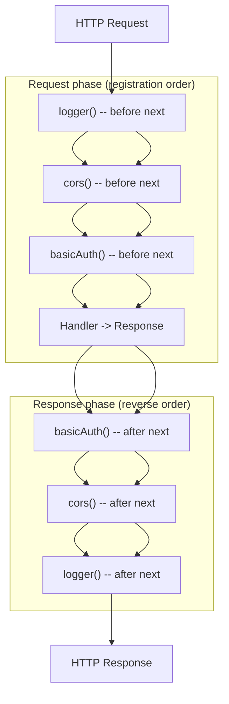

# Middleware: The Onion, `await next()`, Ordering

**Doc Source**: [Hono — Middleware](https://hono.dev/docs/guides/middleware)

## The Core Concept: Why This Example Exists

**The Problem:** Web applications need cross-cutting concerns — logging every request, enforcing auth, adding CORS headers, rate limiting, attaching request IDs, compressing responses — that must run for *many* routes but have nothing to do with any single handler's business logic. Copying that logic into each handler duplicates it and guarantees drift. What you need is a way to **wrap** the request-response cycle: intercept the request *before* the handler, optionally short-circuit, and then intercept the response *after* the handler.

**The Solution:** Hono models middleware as **`async (c, next) => { ... }`** functions composed into an **onion**. Code written **before** `await next()` runs on the way **in** (request phase, for every layer); `await next()` hands control to the next middleware and ultimately the handler; code written **after** `await next()` runs on the way **out** (response phase), unwinding in reverse. Execution order is simply **registration order** — the order you call `app.use()`. A middleware that returns a `Response` without calling `next()` **short-circuits** (early exit), which is exactly how auth gates work.

From the docs, the precise contract:

> - **Handler** — should return `Response` object. Only one handler will be called.
> - **Middleware** — should `await next()` and return nothing to call the next Middleware, **or** return a `Response` to early-exit.

Think of middleware as **security checkpoints at an airport**, stacked one behind another. Each checkpoint can examine your boarding pass (the request, on the way in), stamp it (`c.set`), let you through (`await next()`), or turn you away (return a `Response` early). On the way back out, the same checkpoints can inspect your bags one more time (the response). Axum's `middleware::from_fn` (🔗 [`../rust/axum/05-middleware-from-functions.md`](../rust/axum/05-middleware-from-functions.md)) is the closest cross-language analog; Go's `func(http.ResponseWriter, *http.Request, http.HandlerFunc)` chains (🔗 [`../go/MIDDLEWARE_ROUTING.md`](../go/MIDDLEWARE_ROUTING.md)) are the Go form. The curriculum's 🔗 [`REST_API`](../REST_API.md) covers the onion model end-to-end.

## Practical Walkthrough: Code Breakdown

All snippets below are quoted verbatim from the [Hono Middleware docs](https://hono.dev/docs/guides/middleware).

### Registering Middleware: `app.use`

```ts
// match any method, all routes
app.use(logger())

// specify path
app.use('/posts/*', cors())

// specify method and path
app.post('/posts/*', basicAuth())
```

- **`app.use(mw)`** — runs for **every** method on **every** path (the global catch-all; `'/'` is implied).
- **`app.use('/posts/*', mw)`** — scoped to a path prefix (note the trailing `/*`).
- **`app.post('/posts/*', basicAuth())`** — you can also attach middleware inline on a method+path route alongside a handler.

### The Pipeline (before the handler)

The docs give the canonical pipeline example:

```ts
app.use(logger())
app.use(cors())
app.use(basicAuth())
// ...
app.post('/posts', (c) => c.text('Created!', 201))
```

> "In this case, four middleware are processed before dispatching like this:
> `logger() -> cors() -> basicAuth() -> *handler*`"

If any of those middleware returns a `Response` (e.g. `basicAuth()` rejecting bad credentials) the handler never runs.

### Execution Order — The Onion, Demonstrated

This is the single most important example. The docs register three middleware with console logs before and after `await next()`, then a handler:

```ts
app.use(async (_, next) => {
  console.log('middleware 1 start')
  await next()
  console.log('middleware 1 end')
})
app.use(async (_, next) => {
  console.log('middleware 2 start')
  await next()
  console.log('middleware 2 end')
})
app.use(async (_, next) => {
  console.log('middleware 3 start')
  await next()
  console.log('middleware 3 end')
})

app.get('/', (c) => {
  console.log('handler')
  return c.text('Hello!')
})
```

The observed output is the **onion** — in-order on the way down, reverse-order on the way up:

```
middleware 1 start
  middleware 2 start
    middleware 3 start
      handler
    middleware 3 end
  middleware 2 end
middleware 1 end
```

Read this as: `next()` is a **suspension point**. When middleware 1 calls `await next()`, it pauses until everything downstream finishes, then resumes at the line after `next()`. So "before `next()`" code runs in registration order (1→2→3→handler), and "after `next()`" code runs in **reverse** order (handler→3→2→1).

### Error Propagation Note

The docs flag an important simplification:

> "Note that if the handler or any middleware throws, hono will catch it and either pass it to your `app.onError()` callback or automatically convert it to a 500 response before returning it up the chain of middleware. This means that `next()` will never throw, so there is no need to wrap it in a `try/catch/finally`."

So unlike some frameworks, you do **not** need `try { await next() } catch (e) {...}` — Hono guarantees the error becomes a `Response` (and is available via `c.error`, 🔗 [`03-context-helpers.md`](./03-context-helpers.md)).

### Built-in Middleware

Hono ships a set of built-in middleware (no external dependencies). The canonical registration pattern:

```ts
import { Hono } from 'hono'
import { poweredBy } from 'hono/powered-by'
import { logger } from 'hono/logger'
import { basicAuth } from 'hono/basic-auth'

const app = new Hono()

app.use(poweredBy())
app.use(logger())

app.use(
  '/auth/*',
  basicAuth({
    username: 'hono',
    password: 'acoolproject',
  })
)
```

The four most common built-ins (import paths confirmed against [the built-in middleware pages](https://hono.dev/docs/middleware/builtin)):

| Middleware | Import | What it does |
|---|---|---|
| **logger** | `import { logger } from 'hono/logger'` | Logs each request/response line ([docs](https://hono.dev/docs/middleware/builtin/logger)) |
| **cors** | `import { cors } from 'hono/cors'` | Sets `Access-Control-*` headers / handles preflight ([docs](https://hono.dev/docs/middleware/builtin/cors)) |
| **compress** | `import { compress } from 'hono/compress'` | Gzip/brotli-encodes the body per `Accept-Encoding` ([docs](https://hono.dev/docs/middleware/builtin/compress)) |
| **etag** | `import { etag } from 'hono/etag'` | Adds `ETag` headers for caching ([docs](https://hono.dev/docs/middleware/builtin/etag)) |

`compress`, `cors`, and `etag` are **response-phase** middleware — they do their real work **after** `await next()` (transforming the response the handler produced). `logger` straddles both phases (timestamps the in and the out).

### Custom Middleware

You can write middleware inline directly in `app.use`:

```ts
// Custom logger
app.use(async (c, next) => {
  console.log(`[${c.req.method}] ${c.req.url}`)
  await next()
})

// Add a custom header
app.use('/message/*', async (c, next) => {
  await next()
  c.header('x-message', 'This is middleware!')
})

app.get('/message/hello', (c) => c.text('Hello Middleware!'))
```

Notice the second one: `await next()` first, **then** `c.header(...)` — a clean example of the response phase (the header is appended to whatever the handler returned).

For reusable middleware, the docs recommend `createMiddleware` from `hono/factory` so the `Context` and `next` types are preserved and you can type the `Variables` you inject:

```ts
import { createMiddleware } from 'hono/factory'

const logger = createMiddleware(async (c, next) => {
  console.log(`[${c.req.method}] ${c.req.url}`)
  await next()
})
```

### Modifying the Response After `next()`

The docs show how to wholesale replace the response:

```ts
const stripRes = createMiddleware(async (c, next) => {
  await next()
  c.res = undefined
  c.res = new Response('New Response')
})
```

Setting `c.res` after `next()` overrides what the handler returned — useful for wrapping, rewriting, or error-page injection.

### Accessing the Context Inside a Conditional `use`

A subtle but useful pattern — construct a middleware instance *inside* the handler closure so it can read `c.env` (e.g. a per-environment CORS origin):

```ts
import { cors } from 'hono/cors'

app.use('*', async (c, next) => {
  const middleware = cors({
    origin: c.env.CORS_ORIGIN,
  })
  return middleware(c, next)
})
```

### Type Accumulation Across Chained `.use()`

The docs note a powerful type-level feature: each `.use()` returns a new `Hono` instance with **merged** `Variables`, so chained middleware accumulate type information and the handler sees them all:

```ts
const authMiddleware = createMiddleware<{
  Variables: { user: { id: string; name: string } }
}>(async (c, next) => {
  c.set('user', { id: '123', name: 'Alice' })
  await next()
})

const dbMiddleware = createMiddleware<{
  Variables: { db: { query: (sql: string) => Promise<unknown> } }
}>(async (c, next) => {
  c.set('db', {
    query: async (sql) => {
      /* ... */
    },
  })
  await next()
})

const app = new Hono()
  .use(authMiddleware)
  .use(dbMiddleware)
  .get('/', (c) => {
    // Both `user` and `db` are available and type-safe
    const user = c.var.user // { id: string; name: string }
    const db = c.var.db // { query: (sql: string) => Promise<unknown> }
    return c.json({ user })
  })
```

No need to pre-declare a combined `Env` — the type grows as you chain.

## Mental Model: The Onion



**Why it's designed this way.** The `(c, next)` signature plus the in/out onion gives you, for free:

1. **Before-`next` interception** — read/transform the request, short-circuit (auth), attach values (`c.set`).
2. **After-`next` interception** — read/transform the response (`c.res`, `c.header`), compress, add ETags, log timing.
3. **Short-circuit** — return a `Response` without calling `next()` and downstream layers are skipped entirely (a rejected auth never reaches the handler).
4. **Composability** — each middleware is an independent `(c, next) => {...}` function you can unit-test by handing it a fake Context and a fake `next`.

The ordering rule — **registration order determines execution order** — is deliberately simple and predictable. There is no implicit priority system; what you write top-to-bottom is exactly what runs outside-in.

### Pitfalls

- **Order matters more than you think.** `app.use(cors())` placed **after** `app.post('/things', h)` will **not** protect `/things` — middleware registered below a matching route never runs for that route (same registration-order rule as routing, 🔗 [`02-routing-patterns.md`](./02-routing-patterns.md)). Put global middleware at the **top**, before route handlers.
- **Forgetting `await` on `next()`.** `next()` returns a `Promise`. If you write `next()` without `await`, the response phase of that middleware runs **before** the handler finishes — your "after" code sees an incomplete response. Always `await next()`.
- **No need for try/catch around `next()`.** Hono guarantees `next()` does not throw (errors become a `Response` via `app.onError`). Wrapping it is dead code; use `c.error` (read after `next()`) if you need post-hoc error inspection.
- **Returning vs not returning.** A middleware that returns a `Response` **early-exits** the chain. A middleware that returns nothing (just `await next()` and lets the response bubble up) **continues** the chain. Confusing the two is a common auth-bypass or auth-block bug.
- **`c.set` scope is per-request.** Values set in middleware don't outlive the request (🔗 [`03-context-helpers.md`](./03-context-helpers.md)). Don't try to cache across requests on the Context.
- **Deno version mismatch.** The docs warn that importing middleware from a **different** Hono version than the core (possible in Deno's `jsr:` URLs) silently breaks. Pin versions consistently.

### Further Exploration

- Implement a timing middleware: capture `Date.now()` before `await next()`, then log the elapsed milliseconds after.
- Build an auth gate that returns `c.json({ error: 'unauthorized' }, 401)` instead of calling `next()` when a header is missing.
- Compress + ETag: register `compress()` then `etag()` and inspect the response headers to see both applied (note the response-phase interaction).
- Replace a response wholesale: write a maintenance-mode middleware that returns `c.text('down', 503)` before `next()` when `c.env.MAINTENANCE` is set.

### Cross-references

- 🔗 [`REST_API`](../REST_API.md) — the curriculum bundle covering the onion model end-to-end on Node (`@hono/node-server`), including `app.onError`/`app.notFound` as the error/404 layers of the chain.
- 🔗 [`03-context-helpers.md`](./03-context-helpers.md) — `c.set`/`c.get` (the per-request store middleware uses to pass values down) and `c.res`/`c.error` (the response/error middleware reads after `next()`).
- 🔗 [`02-routing-patterns.md`](./02-routing-patterns.md) — middleware obeys the **same registration-order** rule as routes; the catch-all shadowing pitfall applies to middleware too.
- 🔗 [`../rust/axum/05-middleware-from-functions.md`](../rust/axum/05-middleware-from-functions.md) — Axum's `middleware::from_fn(async |req, next| {...})` and `.layer()`. The closest cross-language sibling: same `(request, next)` shape, same onion, but Axum applies layers in **reverse** of chain order (a notable difference to flag).
- 🔗 [`../go/MIDDLEWARE_ROUTING.md`](../go/MIDDLEWARE_ROUTING.md) — Go's `func(http.ResponseWriter, *http.Request, http.HandlerFunc)` middleware chains. Same onion concept, but Go has no `Context` object — values travel via `context.Context`, and each request runs on its own goroutine (vs Hono's single event-loop thread, 🔗 [`EVENT_LOOP`](../EVENT_LOOP.md)).
