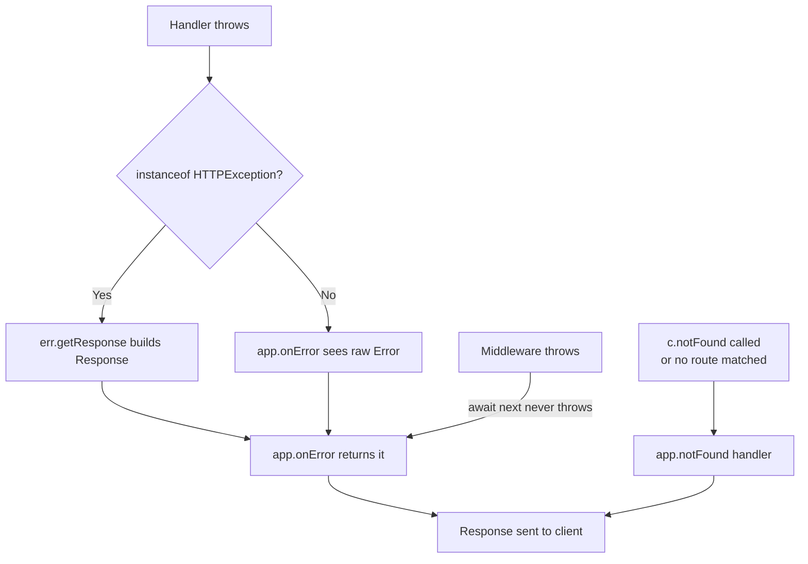

# Error Handling: `onError`, `notFound`, and Custom Errors in Hono

**Doc Source**: [Hono — App: Error Handling & Not Found](https://hono.dev/docs/api/hono#error-handling) · [`HTTPException`](https://hono.dev/docs/api/exception) · [Context: `c.notFound()`](https://hono.dev/docs/api/context#notfound)

## The Core Concept: Why This Example Exists

**The Problem:** In JavaScript, errors are thrown invisibly — any `await` in your handler can reject, any `JSON.parse` can throw, any third-party SDK can explode. Without a single place to catch them, every failure leaks an ugly stack trace to the client (a security hole), an inconsistent `500` shape (a frontend nightmare), or an unhandled rejection that crashes the Node process (an SRE's worst enemy). The 404 case is just as bad: the default "Not Found" body is framework-defined, so your REST contract drifts.

**The Solution:** Hono follows the **single error funnel** pattern. Exactly one place — `app.onError((err, c) => ...)` — sees every uncaught error from any handler or middleware, and converts it into a `Response`. A separate hook, `app.notFound(handler)`, owns the 404 path. Between them sits a typed carrier, `HTTPException`, that lets handlers *throw a status code* instead of building the `Response` themselves — exactly like Axum's `AppError` enum or Go's `http.Error` pattern, but expressed through JS exceptions rather than `Result<T, E>`.

Think of it as the building's emergency-response desk again: any alarm (thrown error, from *anywhere* in the request lifecycle) eventually reaches the same dispatcher (`onError`), who decides the right status, logs the right detail, and emits the right body. The "I can't find that room" case (404) has its own dedicated line so it never gets confused with a real emergency.

## Practical Walkthrough: Code Breakdown

### The default funnel: `app.onError`

`app.onError` registers a handler invoked **whenever** a handler or middleware throws and the throw is not caught earlier. Its signature is `(err, c) => Response | Promise<Response>`:

```ts
import { Hono } from 'hono'

const app = new Hono()

app.onError((err, c) => {
  console.error(`${err}`)
  return c.text('Custom Error Message', 500)
})
```

*Source: [hono.dev/docs/api/hono#error-handling](https://hono.dev/docs/api/hono#error-handling)*

Key points the official docs make explicit:

- **`next()` never throws.** Hono swallows downstream throws inside the middleware chain and routes them to `onError`, so there is no need to wrap `await next()` in `try/catch/finally`. (Source: [hono.dev/docs/guides/middleware](https://hono.dev/docs/guides/middleware))
- **Parent vs. route-level precedence.** The docs note: *"If both a parent app and its routes have `onError` handlers, the route-level handlers get priority."* Use this to mount sub-apps with their own error contracts.
- **The handler owns the `Response`.** You decide status, headers, and body — JSON, text, HTML, redirect, whatever your contract says.

A production-shaped handler separates user-facing and internal errors (the same information-hiding principle as Axum's `IntoResponse` impl):

```ts
app.onError((err, c) => {
  if (err instanceof HTTPException) {
    return err.getResponse()
  }
  console.error(err)                       // internal detail, server-side only
  return c.json({ error: 'Internal Server Error' }, 500)
})
```

*Source: [hono.dev/docs/api/exception#handling-httpexceptions](https://hono.dev/docs/api/exception#handling-httpexceptions)*

### The 404 funnel: `app.notFound` and `c.notFound()`

404s are **not** errors in Hono — they're a normal control-flow branch. Two pieces cooperate:

1. **`c.notFound()`** — call this inside a handler when *you* decide the resource doesn't exist. Hono then runs the registered 404 handler instead of producing a default body:

   ```ts
   app.get('/notfound', (c) => {
     return c.notFound()
   })
   ```

   *Source: [hono.dev/docs/api/context#notfound](https://hono.dev/docs/api/context#notfound)*

2. **`app.notFound(handler)`** — register the global 404 response shape:

   ```ts
   app.notFound((c) => {
     return c.text('Custom 404 Message', 404)
   })
   ```

   *Source: [hono.dev/docs/api/hono#not-found](https://hono.dev/docs/api/hono#not-found)*

> ⚠️ **Pitfall — top-level only.** The official docs warn: *"The `notFound` method is only called from the top-level app."* If you mount a sub-app via `app.route('/api', subApp)`, the sub-app's own `notFound` will **not** fire for unmatched `/api/...` paths — the parent app's `notFound` wins. Plan your 404 contract at the top level. ([honojs/hono#3465](https://github.com/honojs/hono/issues/3465))

### Carrying a status code: `HTTPException`

The missing piece is *how* a handler signals a non-500 failure (400 bad input, 401 unauth, 403 forbidden, 409 conflict) without hand-building a `Response` everywhere. Hono's answer is `HTTPException`, a typed `Error` subclass that carries a status:

```ts
import { HTTPException } from 'hono/http-exception'

// Basic text response — set the message:
throw new HTTPException(401, { message: 'Unauthorized' })

// Or attach a fully-formed Response (headers, custom body shape):
const errorResponse = new Response('Unauthorized', {
  status: 401, // this gets ignored — the constructor's status wins
  headers: { Authenticate: 'error="invalid_token"' },
})
throw new HTTPException(401, { res: errorResponse })
```

*Source: [hono.dev/docs/api/exception#throwing-httpexceptions](https://hono.dev/docs/api/exception#throwing-httpexceptions)*

The `cause` option preserves the original error chain (the JS analog of Rust's `#[source]` or Go's `%w` wrapping):

```ts
app.post('/login', async (c) => {
  try {
    await authorize(c)
  } catch (cause) {
    throw new HTTPException(401, { message, cause })
  }
  return c.redirect('/')
})
```

*Source: [hono.dev/docs/api/exception#cause](https://hono.dev/docs/api/exception#cause)*

Crucially, an **uncaught** `HTTPException` is automatically routed to `app.onError`, where `err.getResponse()` builds the matching `Response` from the status and message/res you supplied:

```ts
app.onError((err, c) => {
  if (err instanceof HTTPException) {
    return err.getResponse()
  }
  console.error(err)
  return c.text('Internal Server Error', 500)
})
```

*Source: [hono.dev/docs/api/exception#handling-httpexceptions](https://hono.dev/docs/api/exception#handling-httpexceptions)*

> ⚠️ **Pitfall — `getResponse()` is not context-aware.** The docs explicitly warn: *"`HTTPException.getResponse` is not aware of `Context`."* If middleware already mutated `c` (set headers, status, etc.), those changes are **lost** when you `return err.getResponse()`. Manually merge them onto a new `Response` if you need them.

### The complete error → response pipeline

Putting the three pieces together, a request flows through this funnel:



Note that **middleware throws also funnel through `onError`** — Hono guarantees `next()` resolves rather than rejecting, so middleware authors never wrap `await next()` in try/catch. This is the inverse of Axum (where middleware returns `Result`) and matches Go's `net/http` (where `panic` is caught by `recover()` in the server).

## When the funnel doesn't catch: streaming callbacks

One sharp edge worth knowing: the streaming helpers (`streamSSE`, `streamText`, `stream`) **do not** trigger `onError` when their callback throws — because by the time the callback runs, the response headers and a `200` have already been flushed. Hono routes those errors to a **third** argument, an inline error handler:

```ts
return stream(c, async (stream) => { /* ... */ }, (err, stream) => {
  stream.writeln('An error occurred!')
  console.error(err)
})
```

*Source: [hono.dev/docs/helpers/streaming#error-handling](https://hono.dev/docs/helpers/streaming#error-handling)*

See 🔗 [`./08-streaming.md`](./08-streaming.md) for the full streaming-error story.

## Cross-References

> 🔗 [`../REST_API.md`](../REST_API.md) — owns the **REST error contract** layer: status-code discipline, the "HTTP errors are not rejections" rule, and how `onError` shapes the JSON body a frontend consumes.
>
> 🔗 [`../ERRORS_EXCEPTIONS.md`](../ERRORS_EXCEPTIONS.md) — the language-level foundation: `throw`/`try`/`catch`, `Error.cause`, `instanceof` narrowing (the exact pattern `err instanceof HTTPException` relies on), and why rejections behave like synchronous throws.
>
> 🔗 [`../OBSERVABILITY.md`](../OBSERVABILITY.md) — `console.error(err)` here is the naive form; structured logging with a per-request `traceId` (via AsyncLocalStorage, see `./06-context-storage-als.md`) turns `onError` into the **right** place to emit an error span.
>
> 🔗 [`../../rust/axum/04-error-handling.md`](../../rust/axum/04-error-handling.md) — the type-system mirror. Where Hono uses `throw` + `instanceof`, axum uses `Result<T, AppError>` + `impl IntoResponse for AppError` + `?`-propagation. Same funnel shape (`IntoResponse` ≈ `onError`), different mechanism (compile-time exhaustiveness vs runtime `instanceof`).
>
> 🔗 [`../../go/ERRORS.md`](../../go/ERRORS.md) — Go's `error` is a value (no exceptions); `http.Error(w, msg, code)` is the closest analog to throwing an `HTTPException`. The funnel equivalent is a single `recover()` middleware or an `errors.As` switch in the top-level handler.
