# Per-Request Context: `c.set`/`c.get` vs `AsyncLocalStorage`

**Doc Source**: [Hono — Context: `set()` / `get()`](https://hono.dev/docs/api/context#set-get) · [Context Storage Middleware (`hono/context-storage`)](https://hono.dev/docs/middleware/builtin/context-storage)

## The Core Concept: Why This Example Exists

**The Problem:** Almost every non-trivial request needs *request-scoped state*: the authenticated user, a generated `traceId`, a per-request logger, a DB connection, a tenant id. The first instinct is to thread these as function arguments — but the call chain in a real service is deep (`router → auth middleware → controller → service → repository → logger`), and the leaf functions (the logger!) often belong to libraries you don't control. Passing `user` and `traceId` through every signature is noisy and brittle. Yet global mutable state (a module-level `let currentUser`) is *worse*: it corrupts under concurrency, because Node serves many requests interleaved on one event-loop thread.

**The Solution:** Hono gives you **two complementary tools**:

1. **Explicit, typed context** — `c.set('user', user)` / `c.get('user')`. The `Context` object is per-request, carried through the middleware chain by Hono itself. This is the *default* and the safest — the analog of Go's explicit `ctx context.Context` parameter.
2. **Implicit, ambient context** — `AsyncLocalStorage` (via `hono/context-storage`). The `Context` is stashed in Node's async-hook machinery so that *any* code in the async call tree — even a logger deep in a library you didn't write — can call `getContext()` and find the right per-request values, *without* a parameter threaded through.

Think of `c.set` as **carrying your credentials in your hand** (visible, intentional, easy to reason about) and ALS as **wearing a security badge on a lanyard** (always there, picked up automatically by anyone who looks, but invisible in the function signature — which is both its power and its danger).

## Practical Walkthrough: Code Breakdown

### Approach 1 — Explicit context via `c.set` / `c.get`

The `Context` object is instantiated per request and lives until the response is returned. You stash arbitrary key/value pairs on it; the lifetime is exactly the current request — they "cannot be shared or persisted across different requests." (Source: [hono.dev/docs/api/context#set-get](https://hono.dev/docs/api/context#set-get))

```ts
app.use(async (c, next) => {
  c.set('message', 'Hono is cool!!')
  await next()
})

app.get('/', (c) => {
  const message = c.get('message')
  return c.text(`The message is "${message}"`)
})
```

*Source: [hono.dev/docs/api/context#set-get](https://hono.dev/docs/api/context#set-get)*

To make this type-safe, declare the `Variables` shape as a generic on the `Hono` constructor (or on `createMiddleware`):

```ts
type Variables = {
  message: string
}

const app = new Hono<{ Variables: Variables }>()
```

*Source: [hono.dev/docs/api/context#set-get](https://hono.dev/docs/api/context#set-get)*

You can also reach the same values through `c.var` (handy when the value is a function — e.g., a method a middleware injects):

```ts
const result = c.var.client.oneMethod()
```

*Source: [hono.dev/docs/api/context#var](https://hono.dev/docs/api/context#var)*

> ⚠️ **Pitfall — `ContextVariableMap` global augmentation lies.** The docs warn that augmenting `ContextVariableMap` makes a variable look typed on **every** handler — even ones whose middleware never ran. So `c.get('result')` will be `string` at compile time but `undefined` at runtime if the registering middleware was skipped. Prefer the per-app/per-middleware `Variables` generic unless the variable is genuinely app-wide. (Source: [hono.dev/docs/api/context#contextvariablemap](https://hono.dev/docs/api/context#contextvariablemap))

This explicit style maps cleanly onto Go's `ctx.Value(k)` pattern — see 🔗 [`../../go/CONTEXT.md`](../../go/CONTEXT.md) and the cross-language note below.

### Approach 2 — Implicit context via `AsyncLocalStorage` (`hono/context-storage`)

When the call chain is deep or you don't control the leaf functions (a logging library, an ORM hook, a tracing SDK), `c.set` forces you to thread `c` through every signature. The Context Storage Middleware removes that friction: it runs the rest of the request inside an `AsyncLocalStorage` snapshot of `c`, so any code in the async tree can reach the current `Context` *without* it being a parameter.

```ts
import { Hono } from 'hono'
import {
  contextStorage,
  getContext,
  tryGetContext,
} from 'hono/context-storage'

type Env = {
  Variables: {
    message: string
  }
}

const app = new Hono<Env>()

app.use(contextStorage())          // <-- the only wiring needed

app.use(async (c, next) => {
  c.set('message', 'Hello!')
  await next()
})

// `getContext()` works OUTSIDE the handler — in any function called
// during this request, even with no `c` parameter in sight.
const getMessage = () => {
  return getContext<Env>().var.message
}

app.get('/', (c) => {
  return c.text(getMessage())      // returns "Hello!"
})
```

*Source: [hono.dev/docs/middleware/builtin/context-storage#usage](https://hono.dev/docs/middleware/builtin/context-storage#usage)*

The same trick reaches Cloudflare Workers bindings from anywhere in the call tree:

```ts
const setKV = (value: string) => {
  return getContext<Env>().env.KV.put('key', value)
}
```

*Source: [hono.dev/docs/middleware/builtin/context-storage#usage](https://hono.dev/docs/middleware/builtin/context-storage#usage)*

For code that runs both inside and outside a request (background jobs, CLI tools, warmup code), use `tryGetContext()` — it returns `undefined` instead of throwing when there's no active ALS context:

```ts
const context = tryGetContext<Env>()
if (context) {
  console.log(context.var.message)
}
```

*Source: [hono.dev/docs/middleware/builtin/context-storage#trygetcontext](https://hono.dev/docs/middleware/builtin/context-storage#trygetcontext)*

> ⚠️ **Pitfall — runtime support.** The docs are explicit: *"This middleware uses `AsyncLocalStorage`. The runtime should support it."* On **Cloudflare Workers** you must set `nodejs_compat` (or the newer `nodejs_als`) compatibility flag in `wrangler.toml`, otherwise `getContext()` will throw. On bare Node, Deno, and Bun it works out of the box.

### How ALS actually works (and why it's safe across async hops)

`AsyncLocalStorage` is part of Node's `async_hooks`. The high-level contract: when you call `als.run(store, fn)`, Node snapshots the store and ties it to the current async execution context. Any `await`, `setTimeout`, `setImmediate`, `Promise.then`, or `EventEmitter` callback scheduled *inside* `fn` inherits the snapshot automatically. When the request finishes and the chain unwinds, the snapshot is gone — there's no leak into the next request.

```mermaid
graph TD
    A[Request 1 enters] --> B[contextStorage middleware<br/>als.run&#40;c1, next&#41;]
    B --> C[Handler: c1.set 'user', Alice]
    C --> D["await db.query() — schedules microtask"]
    D --> E[ORM hook / logger — getContext&#40;&#41; returns c1]
    E --> F[Response 1 returned — snapshot discarded]

    G[Request 2 enters concurrently] --> H[als.run&#40;c2, next&#41;]
    H --> I[Handler: c2.set 'user', Bob]
    I --> J["await db.query()"]
    J --> K[getContext&#40;&#41; returns c2 — NOT c1]
    K --> L[Response 2 returned]
```



Because Node serves both requests on the **same** event-loop thread but ALS tracks the *async chain*, not the thread, request 1's logger never sees request 2's `user` even though they interleave. This is the JS analog of Go's `context.Context` flowing through `ctx` parameters, achieved without a parameter — see 🔗 [`../../go/CONTEXT.md`](../../go/CONTEXT.md).

> ⚠️ **Pitfall — `await` is required to preserve the chain.** If you bypass the async machinery — `setTimeout` without `await`, raw `.then()` callbacks scheduled in a detached promise, `process.nextTick` outside the awaited tree, or manually invoking a callback on a *different* async root — the snapshot may not propagate. Stick to `await`-based control flow. This is the same "don't break the promise chain" discipline from 🔗 [`../ASYNC_AWAIT.md`](../ASYNC_AWAIT.md).

### When to pick which

| Situation | Use |
|---|---|
| Handler-to-handler, shallow chain, you control all signatures | `c.set` / `c.get` |
| Cross-middleware values (auth user, request id) | `c.set` / `c.get` |
| Deep call chain into services/repositories you own | Either — `c.set` if you don't mind threading, ALS if you do |
| Logging library / ORM / tracing SDK you **can't** change | **ALS** (`getContext()`) |
| Background job outside any request | `tryGetContext()` returns `undefined`; design the leaf to take explicit args |
| Code that must run on runtimes without ALS | `c.set` / `c.get` (always available) |

Rule of thumb: **default to `c.set`.** Reach for ALS when the alternative is threading `c` (or just one value on it) through 4+ layers you don't fully control.

## Cross-References

> 🔗 [`../ASYNC_PATTERNS.md`](../ASYNC_PATTERNS.md) — owns the **`AsyncLocalStorage` deep dive**: how `als.run(store, fn)` snapshots state, the abort/timeout composition with `signal.aborted`, and the comparison to bounded-queue backpressure. This file is the *Hono-specific* application of that primitive.
>
> 🔗 [`../OBSERVABILITY.md`](../OBSERVABILITY.md) — the canonical ALS use case: a per-request `traceId`/`reqId` set once in middleware and read by every log line thereafter, *without* passing it as an argument. The pattern this middleware enables.
>
> 🔗 [`../REST_API.md`](../REST_API.md) — where `c.set('user', ...)` typically originates: the auth middleware that the REST contract depends on.
>
> 🔗 [`../../go/CONTEXT.md`](../../go/CONTEXT.md) — the **conceptual twin**. Go solves the same problem ("request-scoped values across a deep async call tree") with an *explicit* `ctx context.Context` parameter threaded through every function. ALS is the JS answer to "what if I don't want to thread it?" — same semantics, ambient access, weaker compile-time guarantees.
>
> 🔗 [`../../rust/axum/06-dependency-injection-and-state.md`](../../rust/axum/06-dependency-injection-and-state.md) — the Rust mirror. Axum uses `State<S>` extractors + `Extension`s + `FromRequest` parts for per-request DI; like `c.set`, all of it is **explicit and statically typed**. There is no ALS analog because Tokio tasks don't have JS's async-hook machinery — the type system enforces it instead.
