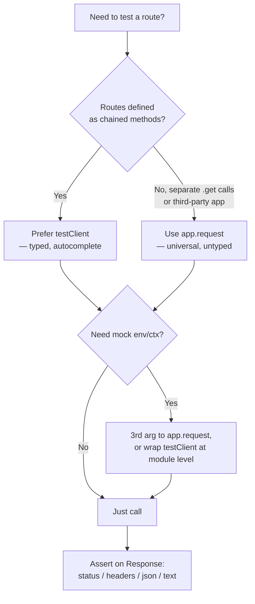

# Testing Hono Apps: `app.request` and the `testClient`

**Doc Source**: [Hono — Guides: Testing](https://hono.dev/docs/guides/testing) · [Helpers: Testing (`hono/testing`)](https://hono.dev/docs/helpers/testing)

## The Core Concept: Why This Example Exists

**The Problem:** End-to-end testing a web app classically means standing up a real server on a real port, firing real HTTP at it, and parsing real responses back. That's slow (port allocation, sockets, OS-level teardown), flaky (port conflicts, firewall, DNS), and obscures failures (a 500 looks the same whether the bug is in your routing or in the OS). It also makes mocking `c.env` bindings (Cloudflare KV, D1, secrets) almost impossible — those only exist inside the worker runtime.

**The Solution:** Hono's `app.request(path, init?, env?)` is the **in-process** entry point: it takes the same `(Request, Env, ExecutionContext)` your production `fetch` handler takes, runs the entire middleware → router → handler pipeline, and returns the `Response` — **without binding a port, opening a socket, or leaving the process.** Because it's pure in-memory, it's deterministic, instant, and lets you inject mock bindings directly. On top of it, `testClient(app)` from `hono/testing` provides a **typed, RPC-style** facade — `client.search.$get({ query: { q: 'hono' } })` — so your tests get autocomplete and type-checking against the *real* route shapes.

Think of `app.request` as the **postal system's internal mail**: instead of dropping a letter in an outside box (real HTTP), routing it through sorting facilities (the network stack), and waiting for delivery, you walk it directly to the recipient's desk (the dispatcher) and get the reply on the spot. Same letter, same handling, no transit time.

## Practical Walkthrough: Code Breakdown

### Approach 1 — `app.request`: the in-process HTTP client

The docs put it plainly: *"All you need to do is create a Request and pass it to the Hono application to validate the Response. You can then use the useful `app.request` method."* (Source: [hono.dev/docs/guides/testing](https://hono.dev/docs/guides/testing))

Given a small REST app:

```ts
app.get('/posts', (c) => {
  return c.text('Many posts')
})

app.post('/posts', (c) => {
  return c.json(
    {
      message: 'Created',
    },
    201,
    {
      'X-Custom': 'Thank you',
    }
  )
})
```

*Source: [hono.dev/docs/guides/testing](https://hono.dev/docs/guides/testing)*

A `GET` test passes a path string and reads the resulting `Response`:

```ts
describe('Example', () => {
  test('GET /posts', async () => {
    const res = await app.request('/posts')
    expect(res.status).toBe(200)
    expect(await res.text()).toBe('Many posts')
  })
})
```

*Source: [hono.dev/docs/guides/testing](https://hono.dev/docs/guides/testing)*

A `POST` test passes a standard `RequestInit` (`method`, `body`, `headers`) — **exactly** the shape you'd give `fetch()` on the client side, which is the whole point: tests speak the same protocol as production code:

```ts
test('POST /posts', async () => {
  const res = await app.request('/posts', {
    method: 'POST',
    body: JSON.stringify({ message: 'hello hono' }),
    headers: new Headers({ 'Content-Type': 'application/json' }),
  })
  expect(res.status).toBe(201)
  expect(res.headers.get('X-Custom')).toBe('Thank you')
  expect(await res.json()).toEqual({
    message: 'Created',
  })
})
```

*Source: [hono.dev/docs/guides/testing](https://hono.dev/docs/guides/testing)*

You can also hand it a fully-built `Request` object — useful when you need fine control over URL, headers, or body stream:

```ts
test('POST /posts', async () => {
  const req = new Request('http://localhost/posts', {
    method: 'POST',
  })
  const res = await app.request(req)
  expect(res.status).toBe(201)
})
```

*Source: [hono.dev/docs/guides/testing](https://hono.dev/docs/guides/testing)*

> **Note.** All assertions are on the standard `Response` interface — `res.status`, `res.headers.get(...)`, `await res.text()`, `await res.json()`. There is **nothing Hono-specific** about the response side: any fetch-shaped testing utility can consume it. That's by design.

### Mocking `c.env` (Cloudflare bindings, secrets) — the third argument

The killer feature for testing Hono-on-Workers: bindings like `KV`, `D1`, `API_HOST` normally only exist inside the worker runtime. `app.request` accepts a mock `env` as its **third argument**, which Hono surfaces as `c.env` inside handlers:

```ts
const MOCK_ENV = {
  API_HOST: 'example.com',
  DB: {
    prepare: () => {
      /* mocked D1 */
    },
  },
}

test('GET /posts', async () => {
  const res = await app.request('/posts', {}, MOCK_ENV)
})
```

*Source: [hono.dev/docs/guides/testing#env](https://hono.dev/docs/guides/testing#env)*

So the signature is `app.request(input, requestInit?, env?, executionCtx?)` — the same three things your production `fetch(request, env, ctx)` receives, in roughly the same order. There's no port, no server, no network. This is the **deterministic, sub-millisecond** style called out by 🔗 [`../TESTING.md`](../TESTING.md): the test exercises the *real* routing + middleware + handler pipeline, but with no I/O variance.

### Approach 2 — `testClient`: the typed RPC facade

`app.request` is ergonomic but untyped — you can pass any string and the compiler won't catch a typo'd path or a wrong query-param shape. `testClient(app)` (from `hono/testing`) wraps `app.request` with the same type inference Hono's RPC client uses, so editor autocomplete shows you `client.search.$get(...)` with the right `query`/`json`/`form` shapes.

```ts
import { testClient } from 'hono/testing'
import { describe, it, expect } from 'vitest'
import app from './app'

describe('Search Endpoint', () => {
  const client = testClient(app)

  it('should return search results', async () => {
    const res = await client.search.$get({
      query: { q: 'hono' },
    })

    expect(res.status).toBe(200)
    expect(await res.json()).toEqual({
      query: 'hono',
      results: ['result1', 'result2'],
    })
  })
})
```

*Source: [hono.dev/docs/helpers/testing#testclient](https://hono.dev/docs/helpers/testing#testclient)*

The call site mirrors Hono's RPC client (🔗 [`../REST_API.md`](../REST_API.md) covers the RPC story). Path segments become properties (`client.search`, `client.posts[':id']`), HTTP methods become `.$get()` / `.$post()` / `.$put()` / `.$delete()`, and the argument object's keys (`query`, `param`, `json`, `form`) are typed from your validators.

Headers / extra `RequestInit` go in the **second** argument — useful for auth tokens or custom content types:

```ts
const token = 'this-is-a-very-clean-token'
const res = await client.search.$get(
  {
    query: { q: 'hono' },
  },
  {
    headers: {
      Authorization: `Bearer ${token}`,
      'Content-Type': `application/json`,
    },
  }
)
```

*Source: [hono.dev/docs/helpers/testing#testclient](https://hono.dev/docs/helpers/testing#testclient)*

> ⚠️ **Pitfall — chaining is required for type inference.** The docs are emphatic: *"For the `testClient` to correctly infer the types of your routes … **you must define your routes using chained methods directly on the `Hono` instance**."* The common `const app = new Hono(); app.get(...)` pattern **breaks inference** — `testClient` falls back to untyped. Instead write:
>
> ```ts
> // ✅ chained — types flow through .get()
> const app = new Hono().get('/search', (c) => {
>   const query = c.req.query('q')
>   return c.json({ query, results: ['result1', 'result2'] })
> })
> ```
>
> *Source: [hono.dev/docs/helpers/testing#testclient](https://hono.dev/docs/helpers/testing#testclient)*
>
> This is the same chaining rule as the RPC `AppType` export — type info accumulates through each `.get()/.post()/.route()` call. If you split routes into separate files, chain at the *export* boundary (see the "larger application" pattern in the RPC docs).

### `app.request` vs `testClient` — when to use which



| Situation | Use |
|---|---|
| Test against your own typed routes, vitest/jest | `testClient(app)` |
| Test a third-party / untyped Hono app | `app.request(path, init)` |
| Need to mock `c.env` bindings | `app.request(path, {}, MOCK_ENV)` (or pass `env` through a wrapped client) |
| Need full control over `Request` (custom URL, body stream) | `app.request(new Request(...))` |
| Testing streaming / SSE | `app.request` + read the `Response.body` stream |

### Testing error and 404 paths

The same `app.request` exercises the **whole** pipeline — including `app.onError` and `app.notFound`, which are just regular branches of the dispatcher. So testing your error contract (🔗 [`./05-error-handling.md`](./05-error-handling.md)) is one assertion:

```ts
test('unknown route returns custom 404', async () => {
  const res = await app.request('/no-such-path')
  expect(res.status).toBe(404)
  expect(await res.text()).toBe('Custom 404 Message')
})

test('bad input surfaces as HTTPException', async () => {
  const res = await app.request('/login', { method: 'POST', body: '{}' })
  expect(res.status).toBe(401)
})
```

No special test harness for errors — they fall out of `app.request` exactly as a real client would see them.

## Cross-References

> 🔗 [`../TESTING.md`](../TESTING.md) — owns the **testing-bundle** foundations: vitest/jest shapes (`describe`/`test`/`expect`), the test-runner matrix, deterministic-vs-flaky test discipline. This file is the Hono application of those primitives — `app.request` is the deterministic, in-process style that bundle recommends.
>
> 🔗 [`../REST_API.md`](../REST_API.md) — the RPC feature. `testClient` is literally the test-time twin of the production `hc<AppType>(...)` client; both depend on the same chained-route type inference. The "routes must be chained" rule is identical.
>
> 🔗 [`./05-error-handling.md`](./05-error-handling.md) — error paths are tested via `app.request` just like success paths; assert on `res.status` and `await res.json()`. No mocking of `onError` needed — it runs as part of the real pipeline.
>
> 🔗 [`../OBSERVABILITY.md`](../OBSERVABILITY.md) — when a test asserts on response shape but you also want to assert on *logs* (e.g. "an error span was emitted"), inject a mock logger via `c.env` or AsyncLocalStorage (🔗 `./06-context-storage-als.md`) and assert against it.
>
> 🔗 [`../../rust/axum/04-error-handling.md`](../../rust/axum/04-error-handling.md) — the axum mirror: `tower::ServiceExt::oneshot(Request::builder()...)` invokes an `axum::Router` in-process, the same idea as `app.request`. Same shape (build a `Request`, await a `Response`), different language.
>
> 🔗 [`../../go/`](../../go/) — Go's `httptest.NewRecorder()` + `handler.ServeHTTP(recorder, req)` is the conceptual twin: invoke the handler in-process, assert on the recorded `ResponseWriter`. `app.request` is Hono's `httptest`-equivalent for the fetch-shaped world.
