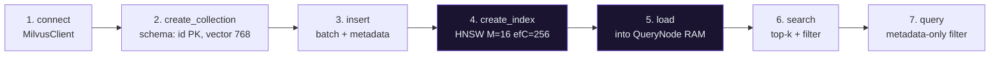
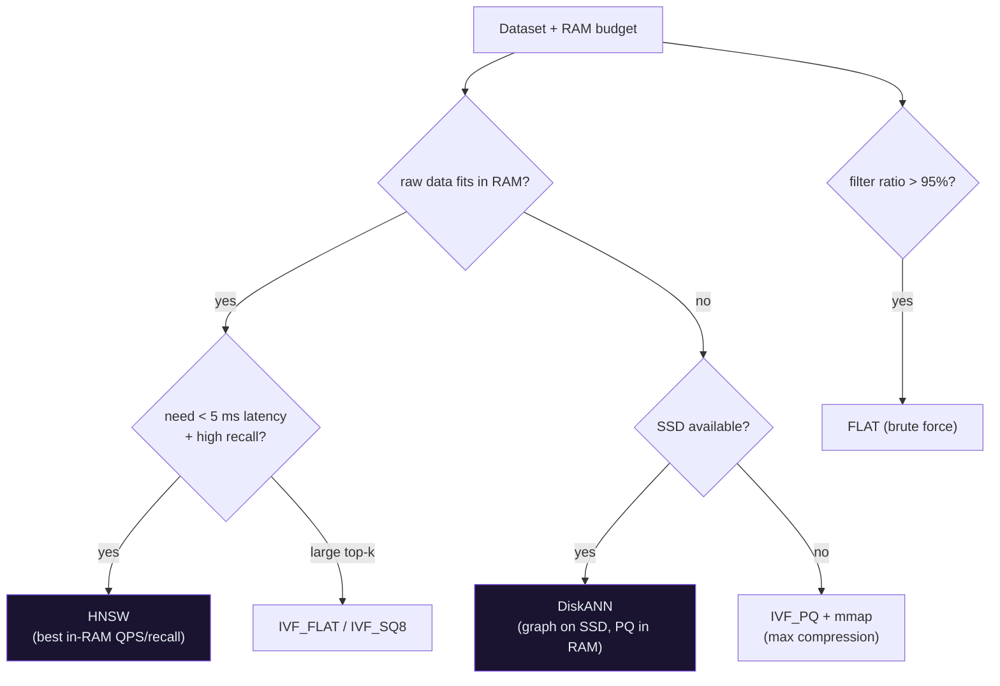

# Milvus — Standalone + Embedded Etcd + External S3: Day 0 to Production

> Companion: [milvus.py](https://github.com/quanhua92/tutorials/blob/main/vector-db/milvus.py) | Live console: [milvus.html](./milvus.html) | Dashboard: [./index.html](./index.html)

A practical, ops-first walkthrough of running **Milvus Standalone** — the single-Docker-image
deployment that collapses the metadata store (embedded etcd) and points all data at a cheap
external object store (S3 / MinIO / R2). Day 0 you deploy it; Day 1 you build a collection and
search it; Day 2 you scale past RAM with DiskANN, prune queries with partitions, back up to S3,
and upgrade cleanly. Every number below is printed by [`milvus.py`](https://github.com/quanhua92/tutorials/blob/main/vector-db/milvus.py) and pasted verbatim under callouts.

**Run the ground truth:**
```bash
cd vector-db && python3 milvus.py > milvus_output.txt
```

---

## 0. TL;DR

> Milvus Standalone with **embedded etcd + external S3** is the *"SQLite of vector DBs"* — one
> Docker container, near-zero ops, yet it scales to ~100M vectors on a single beefy box and to
> billions via **DiskANN** (graph on SSD, PQ in RAM). Storage is cheap object store; the only
> always-on cost is one EC2 instance (~$93/mo for 10M vectors). You only reach for a full Cluster
> when you need high availability, write-scale, or >100M vectors with frequent churn.

The three things to internalize:

1. **Deployment mode = how many processes.** Lite = in-process (Python). Standalone = one image
   with embedded etcd. Cluster = 5+ components + etcd + MinIO + Pulsar on K8s.
2. **Index choice = a RAM-vs-disk trade-off, not a recall-vs-disk trade-off.** HNSW holds
   vectors + graph in RAM (fastest, ~3.2 KB/vec at 768-dim). DiskANN holds only PQ codes in RAM
   and the graph on SSD (~64 B/vec — **50× less RAM** at 768-dim).
3. **Order matters: `create_index()` → `load()` → `search()`.** Get this wrong and you get a
   zero-result search with no error.

---

## 1. Architecture — Standalone vs Cluster

A Milvus deployment has five core components. In **Cluster mode** each runs as its own process; in
**Standalone** they are all packed into one binary:

```mermaid
graph TD
    CLIENT["Client (pymilvus / REST)"] --> PROXY["Proxy<br/>gRPC gateway :19530"]

    subgraph STANDALONE["Milvus Standalone — ONE Docker image"]
        PROXY --> ROOT["RootCoord<br/>DDL/DML + TSO"]
        ROOT --> QC["QueryCoord"]
        ROOT --> DC["DataCoord"]
        ROOT --> IC["IndexCoord"]
        QC --> QN["QueryNode<br/>search over RAM segments"]
        DC --> DN["DataNode<br/>flush binlogs -> S3"]
        IC --> IN["IndexNode<br/>build HNSW/DiskANN/IVF"]
    end

    EE["Embedded etcd<br/>ETCD_USE_EMBED=true<br/>(in-process metadata)"] -.meta.-> STANDALONE
    S3[("External S3 / MinIO / R2<br/>binlogs + index files")] -.data.-> DN
    S3 -.data.-> QN

    style STANDALONE fill:#1a1430,stroke:#8b5cf6,stroke-width:2px,color:#e6edf3
    style EE fill:#0a0e14,stroke:#1abc9c
    style S3 fill:#0a0e14,stroke:#f1c40f
```



In **Cluster mode** the same components fan out across many pods, add a **Pulsar** pub/sub stream
for inserts/deletes, and use a **separate etcd + MinIO**. That is strictly more moving parts.

> From milvus.py Section A:
> ```
> A Milvus deployment has five core components (Cluster mode) that are all
> packed into ONE process for Standalone:
> 
>   Proxy         Client-facing gRPC/REST gateway; validates + routes requests
>   RootCoord     DDL/DML coordinator; TimeTick (TSO) allocation, collection meta
>   QueryCoord    Schedules QueryNodes; auto-load-balancing, replica mgmt
>   QueryNode     Executes vector + scalar search over loaded segments (RAM)
>   DataCoord     Manages segments, flush, compaction; binlog -> object storage
>   DataNode      Consumes insert/delete logs, builds segments, flushes to S3
>   IndexCoord    Dispatches index-build tasks; tracks index meta
>   IndexNode     Builds indexes (HNSW/DiskANN/IVF...); CPU/SSD heavy
> 
> Third-party dependencies:
>   etcd      - metadata + service discovery (EMBEDDED in Standalone mode)
>   MinIO/S3  - object storage for binlogs + index files (external S3 here)
>   Pulsar    - pub/sub for insert/delete stream (Cluster mode ONLY)
> 
> DEPLOYMENT MODE COMPARISON
>   ------------------------------------------------------------------------------------------------
>   mode        components                        min resources       max vectors   use case
>   ------------------------------------------------------------------------------------------------
>   Lite        pymilvus embedded in-process    none              < 1 M     dev / notebook / CI
>   Standalone  1 container, embed etcd, ext S3 2 vCPU / 8 GB     100 M     prod single-node, low ops
>   Cluster     5 comps + etcd + MinIO + Pulsar 8+ nodes (K8s)    1 B+      HA, horizontal scale, >100M
>   ------------------------------------------------------------------------------------------------
> ```

### When Standalone Breaks → Cluster

| problem | standalone limit | cluster solution |
|---|---|---|
| need high availability (no SPOF) | single container | multi-replica QueryNodes |
| write throughput > ~5k inserts/s | 1 DataNode | scale DataNodes horizontally |
| dataset > ~100M + frequent updates | one machine's RAM | shard across QueryNodes |
| multi-region / tenant isolation | 1 rootPath | separate clusters/instances |
| sub-second p99 at huge QPS | 1 QueryNode | read replicas + load balance |

> Rule of thumb: under ~100M vectors and no hard HA requirement, **Standalone + S3 is almost always
> the right economic choice.**

---

## 2. Day 0 — Deploy (30 minutes to running)

### Prerequisites
- **Docker 20.10+** with Compose v2 (raise the VM memory limit — Docker's default 2 GB is too small).
- **An S3-compatible bucket**: AWS S3, MinIO, Cloudflare R2, GCS, Alibaba OSS. Create the bucket
  first (Milvus will use it as-is if it exists and is writable).
- A `.env` file next to the compose file: `S3_ACCESS_KEY=...`, `S3_SECRET_KEY=...`.

### docker-compose.yml

> From milvus.py Section B:
> ```
> version: '3.8'
> 
> services:
>   milvus-standalone:
>     container_name: milvus-standalone
>     image: milvusdb/milvus:v2.5.8          # pin a tag; bump to upgrade
>     command: ["milvus", "run", "standalone"]
>     restart: unless-stopped
>     security_opt:
>       - seccomp:unconfined
>     environment:
>       # ---- EMBEDDED ETCD (no separate etcd container needed) ----
>       ETCD_USE_EMBED: "true"               # run etcd inside the milvus process
>       ETCD_DATA_DIR: /var/lib/milvus/etcd  # persisted etcd data dir
>       ETCD_CONFIG_PATH: /milvus/configs/embedEtcd.yaml
>       # ---- EXTERNAL S3 (no MinIO container needed) ----
>       # Omit COMMON_STORAGETYPE=local so Milvus uses the remote object store.
>       MINIO_ADDRESS: s3.amazonaws.com      # or your MinIO/R2 host
>       MINIO_PORT: "443"
>       MINIO_ACCESS_KEY_ID: ${S3_ACCESS_KEY}
>       MINIO_SECRET_ACCESS_KEY: ${S3_SECRET_KEY}
>       MINIO_USE_SSL: "true"
>       MINIO_BUCKET_NAME: my-milvus-bucket
>       MINIO_ROOT_PATH: milvus              # key prefix; unique per Milvus instance
>       MINIO_CLOUD_PROVIDER: aws            # aws | gcp | aliyun | gcpnative
>       # ETCD_ENDPOINTS is NOT set (embedded etcd serves localhost:2379 internally)
>     volumes:
>       - ${DOCKER_VOLUME_DIRECTORY:-.}/volumes/milvus:/var/lib/milvus
>     ports:
>       - "19530:19530"   # gRPC / pymilvus client port
>       - "9091:9091"     # metrics + /healthz
>       - "2379:2379"     # embedded etcd (optional; for external tools)
>     healthcheck:
>       test: ["CMD", "curl", "-f", "http://localhost:9091/healthz"]
>       interval: 30s
>       start_period: 90s     # give the embedded etcd + boot time to come up
>       timeout: 20s
>       retries: 3
>     deploy:
>       resources:
>         limits:
>           cpus: "4"
>           memory: 8G
> ------------------------------------------------------------------------
> ```

### S3 / MinIO Configuration

| env var | required | example | notes |
|---|---|---|---|
| `MINIO_ADDRESS` | yes | `s3.amazonaws.com` | host of S3/MinIO/R2. Omit to fall back to a local MinIO container. |
| `MINIO_PORT` | yes | `443` | 443 with SSL; 9000 for a local MinIO. |
| `MINIO_ACCESS_KEY_ID` | yes | `${S3_ACCESS_KEY}` | map from `.env`, never hardcode. |
| `MINIO_SECRET_ACCESS_KEY` | yes | `${S3_SECRET_KEY}` | map from `.env`. |
| `MINIO_USE_SSL` | yes | `true` | `true` for AWS/R2; `false` for plain MinIO. |
| `MINIO_BUCKET_NAME` | yes | `my-milvus-bucket` | must exist & be writable; reused if present. |
| `MINIO_ROOT_PATH` | recommended | `milvus` | key prefix; **unique per Milvus instance** to share one bucket. |
| `MINIO_CLOUD_PROVIDER` | optional | `aws` | `aws` \| `gcp` \| `aliyun` \| `gcpnative`. |
| `ETCD_USE_EMBED` | yes | `true` | collapses etcd into the Milvus process. |
| `ETCD_DATA_DIR` | yes | `/var/lib/milvus/etcd` | must be on the persisted volume. |

> **Cloudflare R2 note:** R2 is S3-compatible. Set `MINIO_ADDRESS=<account>.r2.cloudflarestorage.com`,
> `MINIO_PORT=443`, `MINIO_USE_SSL=true`, `MINIO_CLOUD_PROVIDER=aws`. R2 has **zero egress fees**,
> which makes it especially cheap for backups and restores.

### Deploy & Verify

```bash
# 1. Start
docker compose up -d

# 2. Health check (Docker healthcheck hits /healthz on :9091)
curl -f http://localhost:9091/healthz          # expect: OK

# 3. Connect test
python3 -c "from pymilvus import MilvusClient; \
  c = MilvusClient('http://localhost:19530'); \
  print(c.list_collections())"                 # expect: []
```

### Resource Sizing

> From milvus.py Section B:
> ```
> RESOURCE SIZING (Standalone)
> ------------------------------------------------------------------------
>   tier    vCPU  RAM     disk      max vectors (HNSW)    max vectors (DiskANN)
>   ------------------------------------------------------------------------
>   dev     2     4 GB    20 GB     ~1 M                  ~10 M
>   small   4     8 GB    100 GB    ~5 M                  ~50 M
>   med     8     32 GB   500 GB    ~20 M                 ~100 M
>   large   16    64 GB   1 TB      ~40 M                 ~100 M+
>   ------------------------------------------------------------------------
>   Milvus officially recommends >= 2 vCPU and >= 8 GB RAM per node;
>   Docker's default 2 GB limit is too small -- always raise it.
> 
> BOOT TIME EXPECTATION
>   Embedded-etcd Standalone is typically ready in 30-90s
>   (the healthcheck start_period is 90s to absorb worst case).
>   Cluster cold-start is minutes; Lite is sub-second (in-process).
> ```

---

## 3. Day 1 — First Collection → Search (1 hour)



### Connect

```python
from pymilvus import MilvusClient, DataType
client = MilvusClient(uri="http://localhost:19530")
```

### Create Collection with Schema

```python
schema = MilvusClient.create_schema()
schema.add_field("id",       DataType.INT64,       is_primary=True)
schema.add_field("vector",   DataType.FLOAT_VECTOR, dim=768)
schema.add_field("text",     DataType.VARCHAR, max_length=256)
schema.add_field("category", DataType.VARCHAR, max_length=32)
schema.add_field("ts",       DataType.INT64)        # epoch seconds
client.create_collection("docs", schema=schema)
```

### Insert Vectors

```python
rows = [{"id": i, "vector": embed(text_i), "text": text_i,
         "category": cat_i, "ts": ts_i} for i in range(5000)]
client.insert("docs", rows)
```

### Create Index

```python
idx = client.prepare_index_params()
idx.add_index(field_name="vector", index_type="HNSW", metric_type="COSINE",
              params={"M": 16, "efConstruction": 256})
client.create_index("docs", index_params=idx)
```

**HNSW params explained:** `M` = graph degree per node per layer (higher = more recall + more RAM);
`efConstruction` = search beam width *while building* (higher = better graph, slower build). At
query time you also pass `ef` (search beam) — raise it for higher recall.

### Load & Search

```python
client.load_collection("docs")                      # REQUIRED before search
res = client.search("docs", data=[query_vec], limit=5,
                    filter="category == 'finance'",
                    search_params={"params": {"ef": 64}},
                    output_fields=["text", "category"])
```

### Verify (simulated, deterministic)

> From milvus.py Section C:
> ```
> STEP 1 - CONNECT
>   from pymilvus import MilvusClient, DataType
>   client = MilvusClient(uri='http://localhost:19530')
>   -> connected. list_collections() = []
> 
> STEP 2 - CREATE COLLECTION with schema
>   schema = MilvusClient.create_schema()
>   schema.add_field('id',      DataType.INT64,     is_primary=True)
>   schema.add_field('vector',  DataType.FLOAT_VECTOR, dim=768)
>   schema.add_field('text',    DataType.VARCHAR, max_length=256)
>   schema.add_field('category',DataType.VARCHAR, max_length=32)
>   schema.add_field('ts',      DataType.INT64)   # epoch seconds
>   client.create_collection('docs', schema=schema)
>   -> Collection 'docs' created. PK=id, vector dim=768.
> 
> STEP 3 - INSERT a batch of vectors (deterministic)
>   inserted 5000 entities (5 categories, deterministic vectors)
>   example id=0 -> category=news, ||vector||=27.9368
> 
> STEP 4 - CREATE INDEX (HNSW)
>   idx = client.prepare_index_params()
>   idx.add_index(field_name='vector', index_type='HNSW', metric_type='COSINE',
>                  params={'M': 16, 'efConstruction': 256})
>   client.create_index('docs', index_params=idx)
>   -> HNSW index built (M=16, efConstruction=256, COSINE).
>   RULE: create_index() BEFORE load(); load() BEFORE search().
> 
> STEP 5 - LOAD collection into memory
>   client.load_collection('docs')
>   -> 'docs' loaded. QueryNodes now hold the index + vectors in RAM.
> 
> STEP 6 - SEARCH top-5 with a scalar filter
>   res = client.search('docs', data=[query_vec], limit=5,
>        filter="category == 'finance'", output_fields=['text','category'])
>   -> top-5 (category='finance', 1000 candidates scanned):
>      id=2966  score=0.1362  text=document-02966
>      id=4466  score=0.1024  text=document-04466
>      id=1061  score=0.1002  text=document-01061
>      id=1666  score=0.0958  text=document-01666
>      id=4231  score=0.0911  text=document-04231
> 
> STEP 7 - QUERY (non-vector, pure metadata filter)
>   q = client.query('docs', filter="category == 'tech' and ts < 1700000300",
>                    output_fields=['id','ts'], limit=3)
>      id=4     ts=1700000240
> 
> COLLECTION STATS
> ------------------------------------------------------------------------
>   row_count              = 5000
>   raw vector bytes       = 15,360,000  (0.015 GB)
>   HNSW index RAM         = 16,000,000  (0.015 GiB)
>   S3 footprint (~2x raw) = 30,720,000  (0.031 GB)
> ------------------------------------------------------------------------
> ```

---

## 4. Day 2 — Scale Beyond RAM

Once the dataset outgrows RAM, HNSW (which holds vectors + graph in RAM) becomes impossible on
one machine. Day 2 moves to DiskANN, partitions, backups, and clean upgrades.

### DiskANN: Billion-Scale on a Single Machine

DiskANN stores the **Vamana graph + full-precision vectors on SSD** and keeps only **PQ-compressed
vectors in RAM** for fast distance estimation. This is what lets a single node serve 100M+ vectors
that HNSW could never hold.

> From milvus.py Section D:
> ```
> DISKANN - billion-scale on one box
> ------------------------------------------------------------------------
> DiskANN stores the Vamana graph + full-precision vectors on SSD and keeps
> only PQ-compressed vectors in RAM for fast distance estimation. This is
> what lets a single node serve 100M+ vectors that HNSW could never hold.
> 
>   scale         HNSW RAM        DiskANN RAM     RAM ratio (HNSW/DiskANN)fits 64 GB node?
>   ------------------------------------------------------------------------
>   1M                  3.0 GiB       0.06 GiB                50x              yes
>   10M                29.8 GiB       0.60 GiB                50x              yes
>   100M              298.0 GiB       5.96 GiB                50x              yes
>   1B               2980.2 GiB      59.60 GiB                50x              yes
>   ------------------------------------------------------------------------
>   DiskANN needs ~1/10th (conservatively) to ~1/50th the RAM of HNSW
>   (50x here at dim=768); the gap is largest at high dimension because
>   HNSW's raw-vector footprint scales with dim while DiskANN's PQ does not.
> 
>   DiskANN BUILD TIME (representative, single node, SSD):
>     1M      10-30 min
>     10M     1-3 h
>     100M    6-12 h
>     1B      1-2 days
>   (vs HNSW which is roughly 2-5x faster to build but needs all data in RAM)
> ```

```python
# Build a disk index for a collection too big for RAM
idx = client.prepare_index_params()
idx.add_index(field_name="vector", index_type="DISKANN", metric_type="L2",
              params={})
client.create_index("big_docs", index_params=idx)
client.load_collection("big_docs")     # only PQ codes + a small graph overlay enter RAM
```

> DiskANN needs an SSD-backed node — the graph is navigated via random disk reads. On a spinning
> disk its latency collapses.

### Partitions: Time-Based Query Pruning

> From milvus.py Section D:
> ```
> PARTITIONS - time-based query pruning
> ------------------------------------------------------------------------
>   Partition the collection by a coarse filter key (date, tenant). Then
>   scope every search to ONE partition -> Milvus skips the other N-1.
> 
>   collection: 100,000,000 vectors partitioned into 365 daily partitions
>   per partition: 273,972 vectors
>   search scoped to 1 day scans 273,972 / 100,000,000 = 0.27% of data
>   -> up to 365x less work when the query is time-bounded.
>   python: client.create_partition('docs', 'p_2025_06_27')
>           client.search('docs', partition_names=['p_2025_06_27'], ...)
> 
>   Default partition limit is 1024 (raise via cluster config); prefer
>   partition KEYS (auto-routing) over thousands of manual partitions.
> ```

```python
client.create_partition("docs", "p_2025_06_27")
# insert into that day's partition
client.insert("docs", rows, partition_name="p_2025_06_27")
# search ONLY today -> prunes 364/365 of the data
client.search("docs", data=[q], limit=5,
              partition_names=["p_2025_06_27"])
```

### Backup & Restore

> From milvus.py Section D:
> ```
> BACKUP - S3 snapshot workflow (milvus-backup)
> ------------------------------------------------------------------------
>   milvus-backup reads collection meta + segment parquet files and copies
>   them from the source S3 bucket to a backup bucket, then calls import()
>   to restore. Data is stored as parquet in S3, so a backup is just a copy.
> 
>   example: backup 'docs' (10,000,000 vectors, dim=768)
>     raw bytes        = 30,720,000,000 (30.72 GB)
>     backup size (~2x)= 61,440,000,000 (61.44 GB)
>     est. copy @ 200 MB/s = 307s (5.1 min)
>   CLI:
>     backup create  -n docs_backup_20250627 --collection docs
>     backup restore -n docs_backup_20250627 --collection docs
> ```

```bash
# Configure backup.yaml with source S3 + backup S3 creds, then:
./milvus-backup create  -n docs_backup_20250627 --collection docs
./milvus-backup restore -n docs_backup_20250627 --collection docs
```

### Upgrade Milvus

> From milvus.py Section D:
> ```
> UPGRADE - Standalone rolling upgrade
> ------------------------------------------------------------------------
>   1. docker compose down                       # graceful stop
>   2. edit docker-compose.yml -> bump image tag # e.g. v2.5.8 -> v2.5.11
>   3. docker compose pull                       # fetch new image
>   4. docker compose up -d                      # reuse volumes -> data safe
>   5. curl localhost:9091/healthz               # verify
>   Data on the S3 bucket + embedded-etcd volume is untouched; only the
>   binary changes. Always BACKUP before a minor/major bump.
> ```

---

## 5. Index Types — Choosing the Right One

Memory math is **pinned** to the formulas in [milvus.io/docs/index-explained.md](https://milvus.io/docs/index-explained.md);
the QPS/recall/build-time columns are **representative benchmark ranges** (hardware + dataset dependent).

> From milvus.py Section E:
> ```
> MEMORY PER VECTOR (dim=768, at 10M scale) + TRADE-OFFS
>   --------------------------------------------------------------------------------------------
>   index      bytes/vec  RAM @10M     recall@10  QPS       build       disk
>   --------------------------------------------------------------------------------------------
>   FLAT       3072        28.61 GiB   100%       low       none        none (RAM)
>   IVF_FLAT   3072        28.61 GiB   95-98%     high      minutes     none (RAM)
>   IVF_SQ8    768          7.15 GiB   90-95%     high      minutes     none (RAM)
>   IVF_PQ     96           0.89 GiB   80-90%     very hi   minutes     none (RAM)
>   HNSW       3200        29.80 GiB   95-99%     highest   min-hours   none (RAM)
>   DiskANN    64           0.60 GiB   90-95%     medium    hours-days  SSD (graph)
>   --------------------------------------------------------------------------------------------
> 
> WHICH INDEX FITS 8 GB RAM for 10M x 768-dim vectors?
> ------------------------------------------------------------------------
>   FLAT         28.61 GiB   too big 
>   IVF_FLAT     28.61 GiB   too big 
>   IVF_SQ8       7.15 GiB   FITS    
>   IVF_PQ        0.89 GiB   FITS      <-- recommended
>   HNSW         29.80 GiB   too big 
>   DiskANN       0.60 GiB   FITS      <-- recommended
> ------------------------------------------------------------------------
>   HNSW would need ~30 GiB for 10M x 768 -- it does NOT fit an 8 GB box.
>   DiskANN (PQ in RAM, graph on SSD) and IVF_PQ are the RAM-friendly picks.
> 
> OFFICIAL DECISION MATRIX (milvus.io/docs/index-explained.md)
> ------------------------------------------------------------------------
>   raw data fits in memory           -> HNSW / IVF + refinement
>   raw data on SSD                   -> DiskANN
>   raw on disk, limited RAM          -> IVF_PQ / IVF_SQ8 + mmap
>   filter ratio > 95%                -> FLAT (brute force)
>   large k (>=1% of dataset)         -> IVF (cluster pruning)
>   recall > 99%, latency relaxed     -> FLAT (+ GPU)
> ------------------------------------------------------------------------
> ```



---

## 6. Cost Analysis — Why Standalone + S3 Wins

The whole economics case: **storage is cheap object store**, and the only always-on cost is ONE
EC2 box. Cluster multiplies the always-on cost ~5×.

> From milvus.py Section F:
> ```
> VECTOR STORAGE MATH
>   raw bytes = N x dim x 4  (float32; use x1 for SQ8, x1 for PQ code byte)
> 
>   scale   dim   raw bytes         raw GB    S3 std $/mo   S3 IA $/mo  S3+index $/mo (~2x)
>   --------------------------------------------------------------------------------
>   1M      768   3,072,000,000     3.072     $0.0707       $0.0384     $0.1413
>   10M     768   30,720,000,000    30.720    $0.7066       $0.3840     $1.41
>   100M    768   307,200,000,000   307.200   $7.07         $3.84       $14.13
>   1B      768   3,072,000,000,000 3072.000  $70.66        $38.40      $141
>   --------------------------------------------------------------------------------
>   (S3 standard $0.023/GB-mo, Standard-IA $0.0125/GB-mo, AWS us-east-1 2025)
> 
> EC2 MONTHLY COST (on-demand, AWS us-east-1, 730h/mo, 2025)
> ------------------------------------------------------------------------
>   instance      vCPU  RAM      $/hr     $/mo      fits (HNSW, 768-dim)
>   ------------------------------------------------------------------------
>   t3.medium     2     4 GB   0.0416   $30.37    ~1 M (raw 3 GB)
>   r5.large      2     16 GB   0.126    $91.98    ~5 M (raw 15 GB) - use DiskANN
>   r5.xlarge     4     32 GB   0.252    $184      ~10 M (raw 30 GB) - use DiskANN
>   r5.2xlarge    8     64 GB   0.504    $368      ~20 M (raw 60 GB) / 100M+ via DiskANN
>   ------------------------------------------------------------------------
> 
> FULL COST BREAKDOWN: Standalone + S3  vs  Cluster
> ------------------------------------------------------------------------
>   Scenario: 10M vectors, dim=768
>   STANDALONE (r5.large + S3):
>     EC2 r5.large        = $91.98/mo
>     S3 storage          = $1.41/mo
>     TOTAL               = $93.39/mo   (1 always-on box)
>   CLUSTER (5 x r5.large + shared etcd/minio + S3):
>     EC2 5 x r5.large    = $460/mo
>     S3 storage          = $1.41/mo
>     TOTAL               ~ $461/mo   (5 always-on boxes)
>   Cluster is ~4.9x the cost of Standalone at this scale.
> ------------------------------------------------------------------------
> 
> ROI - WHEN DOES STANDALONE BREAK -> CLUSTER?
> ------------------------------------------------------------------------
>   problem                                   standalone limit      cluster solves it
>   --------------------------------------------------------------------------------------------
>   need high availability (no SPOF)          single container      multi-replica QueryNodes
>   write throughput > ~5k inserts/s          1 DataNode            scale DataNodes horizontally
>   dataset > ~100M + frequent updates        one machine's RAM     shard across QueryNodes
>   multi-region / tenant isolation           1 rootPath            separate clusters/instances
>   sub-second p99 at huge QPS                1 QueryNode           read replicas + load balance
>   --------------------------------------------------------------------------------------------
>   Rule of thumb: under ~100M vectors and no hard HA requirement,
>   Standalone + S3 is almost always the right economic choice.
> ```

> 🔗 [vector_databases.py](https://github.com/quanhua92/tutorials/blob/main/vector-db/vector_databases.py)
> — the sibling bundle that derives the cosine/L2 metrics and ANN algorithms (LSH, HNSW, IVF, PQ)
> from first principles; this guide is the *operations* layer on top of those fundamentals.

---

## 7. Monitoring & Ops

### Key Metrics

| metric | what it means | alert threshold |
|---|---|---|
| `milvus_querynode_collection_loaded_size` | RAM holding loaded collections | > 80% of node RAM |
| `histogram_quantile(search_latency, 0.99)` | search p99 | > 100 ms |
| `milvus_datacoord_segment_num` | growing segment count | > 1000 (needs compaction) |
| `milvus_indexnode_index_build_latency` | index build time | trending up (backlog) |
| `etcd_mvcc_db_total_size_in_use` | embedded etcd DB size | > 2 GB (NOSPACE alarm risk) |
| `go_goroutines` | process goroutines | sudden spike (leak / stuck RPC) |

Point a Prometheus scrape at `http://<host>:9091/metrics` and graph in Grafana.

> From milvus.py Section G:
> ```
> MONITORING ENDPOINT CHECKLIST
> ------------------------------------------------------------------------
>   /healthz                    liveness probe (Docker healthcheck)
>   /metrics                    Prometheus scrape (all Milvus metrics)
>   :9091/metrics               QueryNode/DataNode/IndexNode gauges
>   docker stats                container CPU/MEM (quick sanity)
>   etcdctl endpoint status     embedded etcd DB size + health
> ------------------------------------------------------------------------
> ```

### Troubleshooting

> From milvus.py Section G:
> ```
> COMMON ISSUES (symptom | cause | fix)
> ------------------------------------------------------------------------
>   symptom                             cause                               fix
>   ----------------------------------------------------------------------------------------------------
>   container crashloops / OOM-killed   RAM < 8 GB or index too big         raise memory limit; switch HNSW -> DiskANN/IVF_PQ
>   'requested lease not found'         embedded etcd NOSPACE alarm         compact + defrag etcd; raise quota; restart
>   index builds but search returns 0   load() called before create_index() order: create_index -> load -> search
>   inserts succeed but not searchable  data in growing segment             wait ~1s auto-flush; or flush() sparingly
>   backup restore is very slow         restore re-imports + rebuilds       restore to bigger node; pre-build; BulkImport
>   upgrade loses etcd connection       skipped migration / volume changed  reuse SAME volumes; backup before major bumps
>   search recall suddenly drops        high filter ratio on HNSW graph     switch high-filter path to FLAT, or raise ef
>   disk fills up on the node           etcd + mmap cache on local disk     use external S3 (data) + bigger local disk
> ```

### Killer Gotchas

| trap | symptom | fix |
|---|---|---|
| **Skipping `create_index()` before `load()`** | `load()` succeeds but `search()` returns 0 results, no error | Always: `create_index()` → `load()` → `search()`. With `MilvusClient` you can pass `index_params` at `create_collection` time to auto-index. |
| **Docker default 2 GB memory limit** | container OOM-killed / crashloops within minutes of load | Raise the limit to ≥ 8 GB (`deploy.resources.limits.memory: 8G`). |
| **HNSW on a dataset too big for RAM** | OOM on `load()`, or the node swaps to death | Switch to DiskANN (SSD) or IVF_PQ; do not mmap as a band-aid for an in-RAM graph that never fit. |
| **Sharing a bucket across instances without `MINIO_ROOT_PATH`** | collections collide / cross-talk between two Milvus instances | Give each instance a unique `MINIO_ROOT_PATH` (and ideally a unique `etcd.rootPath`). |
| **Embedded etcd `NOSPACE` alarm** | `requested lease not found`, meta writes fail | `etcdctl compact` + `defrag`; raise the quota; the embedded DB slowly grows. |
| **Restore is 10× slower than backup** | restore re-imports parquet AND rebuilds every index | Restore onto a bigger node, or use BulkImport; budget for a full index rebuild. |
| **Bumping the image tag across a major version** | lost etcd connection / unreadable segments | Reuse the SAME volumes, BACKUP first, follow the release notes for migrations. |
| **Treating partitions as a substitute for sharding** | thousands of manual partitions hit the 1024 limit | Use partition **keys** (auto-routing) for high-cardinality filters; keep manual partitions coarse (by day/tenant). |

### Cheat Sheet

```
DEPLOY      docker compose up -d                                   # embedded etcd + ext S3
HEALTH      curl localhost:9091/healthz                            # -> OK
CONNECT     MilvusClient('http://localhost:19530')
ORDER       create_collection -> insert -> create_index -> load -> search
INDEX       in-RAM & fits      -> HNSW (M=16, efC=256)
            in-RAM & tight      -> IVF_PQ / IVF_SQ8
            too big for RAM     -> DiskANN (needs SSD)
            filter ratio > 95%  -> FLAT
SCALE       1 machine to ~100M (DiskANN); past that -> Cluster
PARTITION   coarse key (date/tenant); search with partition_names=[...]
BACKUP      milvus-backup create/restore (copies parquet in S3)
UPGRADE     down -> bump tag -> pull -> up -d  (reuse volumes, backup first)
METRICS     :9091/metrics  -> Prometheus
RAM BUG #1  load() before create_index() -> 0 results, no error
RAM BUG #2  HNSW on data > RAM -> OOM on load
```

---

## Sources

Official documentation (milvus.io, verified 2025-06):

- [Scale Milvus Standalone](https://milvus.io/docs/scale-standalone.md) — embedded-etcd `standalone_embed.sh`, `ETCD_USE_EMBED=true`, `ETCD_DATA_DIR`, volume mappings, resource scaling.
- [Configure Object Storage (S3) with Docker Compose / Helm](https://milvus.io/docs/deploy_s3.md) — `minio.enabled=false`, `externalS3.*` keys, removing `MINIO_ADDRESS` for remote S3.
- [minio-related Configurations](https://milvus.io/docs/configure_minio.md) — `MINIO_ADDRESS`, `MINIO_ACCESS_KEY_ID`, `MINIO_SECRET_ACCESS_KEY`, `MINIO_USE_SSL`, `MINIO_BUCKET_NAME`, `MINIO_ROOT_PATH`, `cloudProvider` (aws/gcp/aliyun/gcpnative).
- [etcd-related Configurations](https://milvus.io/docs/configure_etcd.md) — `ETCD_ENDPOINTS`, `etcd.rootPath`, `ETCD_USE_EMBED`, embedded etcd data dir.
- [Index Explained](https://milvus.io/docs/index-explained.md) — index-type decision matrix, IVF/HNSW memory math (1M×128-dim HNSW = 640 MB; IVF-PQ = 11 MB), DiskANN/mmap capacity rules.
- [Create Collection](https://milvus.io/docs/create-collection.md) + [Index Vector Fields](https://milvus.io/docs/index-vector-fields.md) — `MilvusClient.create_schema()`, `add_field`, `prepare_index_params`, `create_index`.
- [Manage Partitions](https://milvus.io/docs/manage-partitions.md) — partition pruning, `partition_names` on search.
- [Run Milvus with Docker Compose](https://milvus.io/docs/install_standalone-docker-compose.md) — canonical compose + healthcheck.
- [Upgrade Milvus Standalone with Docker Compose](https://milvus.io/docs/upgrade_milvus_standalone-docker.md) — bump-image-tag rolling upgrade.
- [Overview of Milvus Deployment Options](https://milvus.io/docs/install-overview.md) — Lite / Standalone / Cluster boundaries.
- [Main Components](https://milvus.io/docs/main_components.md) — the 5 core components + 3 dependencies.
- [Troubleshooting](https://milvus.io/docs/troubleshooting.md) + [Operational FAQ](https://milvus.io/docs/operational_faq.md) — etcd sharing, common errors.

Secondary sources (cross-verified):

- [What Milvus version to start with](https://milvus.io/blog/what-milvus-version-to-start-with.md) — Lite/Standalone/Cluster sizing.
- [DiskANN Explained — Milvus Blog](https://milvus.io/blog/diskann-explained.md) — disk-based index for billion-scale, RAM savings.
- [memory usage DiskANN vs HNSW — milvus-io/milvus#35318](https://github.com/milvus-io/milvus/discussions/35318) — RAM-comparison discussion.
- [zilliztech/milvus-backup](https://github.com/zilliztech/milvus-backup) + [How to Use the Milvus Backup Tool](https://milvus.io/blog/how-to-use-milvus-backup-tool-step-by-step-guide.md) — S3 parquet copy backup/restore.
- [Backup and Restore in One Instance](https://milvus.io/docs/single-instance-backup-and-restore.md) — single-instance restore flow.
- [Vector Databases in 2025: Top 10 Index Choices Benchmarked](https://medium.com/@ThinkingLoop/d3-4-vector-databases-in-2025-top-10-index-choices-benchmarked-1bbce68e1871) — HNSW <10 ms @ 95% recall; DiskANN 20–50 ms @ 90%+.
- [HNSW vs DiskANN — Tiger Data](https://www.tigerdata.com/learn/hnsw-vs-diskann) + [Vector Search at Scale](https://netcrit.net/vector-search-at-scale-hnsw-vs-ivf-vs-diskann) — recall/latency cross-checks.
- [AWS S3 pricing](https://aws.amazon.com/s3/pricing/) + [AWS EC2 on-demand pricing](https://aws.amazon.com/ec2/pricing/on-demand/) (us-east-1) — cost-table basis.
