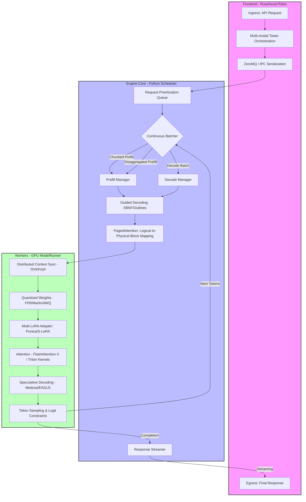

# Mastering vLLM

This course provides a high-level technical exploration of vLLM's internal architecture, memory management, and execution engine. It is designed for engineers and researchers who wish to master the bleeding-edge mechanisms that enable production-grade LLM serving at extreme scale.

## Architecture Evolution: V0, V1, and V2+

vLLM is rapidly evolving from a monolithic Python-centric design to a high-performance distributed system capable of disaggregated execution.

*   **V0 (Legacy Stable):** Monolithic architecture where the API server, scheduler, and model runner live in the same Python process.
*   **V1 (Decoupled Engine):** Multi-process architecture separating the **Frontend** (Rust-based Axum/Tokio), **Engine Core** (Python busy-loop scheduling), and **Workers** (Model Execution).
*   **V2 (Emerging):** Optimized execution path reducing IPC overhead and providing tighter hardware-level integration for sub-millisecond per-token overhead.
*   **Disaggregated Execution:** The next frontier. vLLM now supports **Disaggregated Prefill**, allowing prefill and decode phases to run on different physical nodes, optimizing resource utilization and minimizing "prefill stalls."

## The vLLM Lifecycle: From Request to Token

Expert-level vLLM mastery requires tracing a request through its specialized execution paths.

1.  **Ingress & Multi-Modal Processing:** Requests enter via the Rust/Python frontend. Multi-modal inputs (Vision/Audio) are processed through specialized tower models and projected into the LLM's latent space.
2.  **Guided Decoding & XBNF:** During scheduling, vLLM supports **Guided Decoding** via Outlines/XBNF, enforcing structural constraints (JSON, Regex) at the logits level without sacrificing throughput.
3.  **Scheduling & Continuous Batching:** The `EngineCore` uses **Chunked Prefill** and **Disaggregated Prefill** to manage high-concurrency workloads. Large prompts are either split across iterations or offloaded to dedicated prefill workers.
4.  **Memory Orchestration:** 
    *   **PagedAttention:** Maps logical KV cache blocks to physical GPU memory.
    *   **Multi-LoRA (Punica/S-LoRA):** Efficiently serves thousands of concurrent LoRA adapters by treating adapter weights as "pages" and using specialized kernels to apply them during the forward pass.
5.  **Model Execution & Quantization:** The `ModelRunner` leverages **FP8**, **Marlin**, and **AWQ** quantization to double effective memory bandwidth. Execution is accelerated by **Triton** kernels and **FlashAttention-3**.
6.  **Advanced Speculative Decoding:** vLLM goes beyond simple draft models, supporting **Medusa** and **EAGLE** architectures that use multiple "heads" or lightweight layers to propose multiple future tokens in a single forward pass.
7.  **Distributed Inference:** Execution scales via Tensor, Pipeline, and Sequence Parallelism, utilizing custom all-reduce kernels and high-speed Cross-Node KV cache transfer.

## Syllabus

The chapters below provide an expert roadmap through the vLLM codebase.

*   **[Chapter 1: vLLM Architecture & Evolution](chapter_01_architecture.md)**
    *   V0 to V1/V2 transition; Disaggregated Prefill architecture.
*   **[Chapter 2: PagedAttention & KV Cache](chapter_02_paged_attention.md)**
    *   The OS-paging analogy; Integrating **FlashAttention-3** and **Triton**.
*   **[Chapter 3: Continuous Batching & Scheduling](chapter_03_continuous_batching.md)**
    *   **Chunked Prefill** and **Guided Decoding (XBNF/Outlines)** integration.
*   **[Chapter 4: Memory Management & Multi-LoRA](chapter_04_memory_management.md)**
    *   Block management; **Punica** and **S-LoRA** multi-tenant adapter serving.
*   **[Chapter 5: Python Frontend & Orchestration](chapter_05_python_frontend.md)**
    *   Asynchronous I/O; RequestTracker; FastAPI performance.
*   **[Chapter 6: Rust Frontend & High-Performance IPC](chapter_06_rust_frontend.md)**
    *   Axum/Tokio; ZeroMQ IPC; MessagePack serialization.
*   **[Chapter 7: Distributed & Disaggregated Execution](chapter_07_distributed_execution.md)**
    *   TP/PP/SP; **Disaggregated Prefill** (Prefill/Decode node separation).
*   **[Chapter 8: High-Performance Kernels & Quantization](chapter_08_cuda_kernels.md)**
    *   Custom CUDA/Triton kernels; **FP8**, **Marlin**, and **AWQ** deep dives.
*   **[Chapter 9: Model Runner & Advanced Speculative Decoding](chapter_09_model_runner.md)**
    *   Execution loop; **Medusa**, **EAGLE**, and lookahead scheduling.
*   **[Chapter 10: Multi-Modal & Vision Models](chapter_10_multi_modal.md)**
    *   Vision-Language models; Multi-modal tower orchestration.
*   **[Chapter 11: Mixture of Experts (MoE) & Kernel Tuning](chapter_11_moe_internals.md)**
    *   Fused MoE kernels; Expert sharding; TP-aware MoE.
*   **[Chapter 12: Contributing to vLLM](chapter_12_contributing.md)**
    *   Engineering standards; Performance regression testing.

---

**Repository Context:** [vllm-project/vllm @ `f69ede49`](https://github.com/vllm-project/vllm/tree/f69ede495b3fe97a4b8f6c74d29627f735d46f33)
