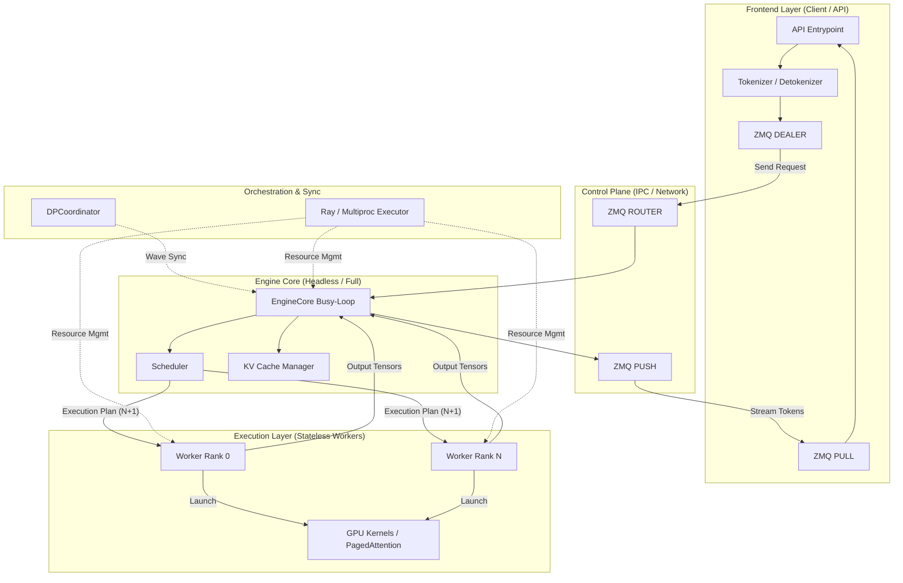

# Chapter 1: vLLM Architecture – Evolution and Distributed Orchestration

This chapter explores the evolution of vLLM's architecture from the monolithic V0 to the decoupled V1, focusing on advanced orchestration, stateless execution, and high-performance control planes.

## 1. Evolution: Monolithic V0 to Decoupled V1

### V0: The Unified Engine
In vLLM V0, the engine was a single process where the API server, scheduler, and model execution shared the same Global Interpreter Lock (GIL).
- **Bottlenecks:** CPU tasks (tokenization, scheduling) frequently blocked GPU execution, leading to "bubbles."
- **Orchestration:** Ray was used as a heavy-weight solution for both worker placement and the control plane (message passing).

### V1: The Decoupled Core
V1 introduces a strict separation between the **Frontend** and the **Engine Core**.
- **Frontend (Client):** Handles high-level API logic, tokenization, and streaming. It can be implemented in Rust for maximum I/O performance.
- **Engine Core (Backend):** A high-performance, CPU-pinned busy-loop managing the scheduler and KV cache.
- **Communication:** ZeroMQ (ZMQ) replaces Ray for the low-latency control plane, enabling sub-millisecond IPC.

## 2. Ray Orchestration vs. ZMQ Control Plane

A common misconception is that ZMQ replaces Ray. In V1, they coexist with distinct responsibilities:

- **Ray (Orchestration):** Responsible for the **Static** topology. It handles resource discovery, process spawning (workers), and `STRICT_PACK` placement groups to ensure CUDA IPC compatibility across GPUs.
- **ZMQ (Control Plane):** Responsible for the **Dynamic** flow. It handles request/response routing, command dispatch, and result streaming. By moving the control plane to ZMQ, vLLM achieves sub-millisecond coordination latency that Ray's RPC layer cannot match.

## 3. The Stateless Worker Pattern

In V1, workers (the processes actually running the GPU kernels) are designed as **Stateless Workers**.

### Architecture of Statelessness:
- **State Centralization:** The `EngineCore` owns the `Scheduler` and `KVCacheManager`. It tracks which physical blocks are mapped to which logical request blocks.
- **Command-Based Execution:** Workers do not make scheduling or memory management decisions. They receive a "Plan" (Batch N+1) from the Core and execute the specific GPU kernels requested.
- **Benefits:**
    - **Interchangeability:** Workers can be replaced or scaled without losing the global state of the engine.
    - **Deterministic Performance:** Execution "bubbles" are minimized because workers never wait on internal state locks or complex Python logic.

## 4. Headless Engines vs. Full Stack

vLLM supports heterogeneous deployment modes to optimize resource usage across clusters:

- **Full Stack:** A node running both the API Frontend and the Engine Core. This is the default for single-node deployments.
- **Headless Engine:** A "remote shard" that runs only the `EngineCore` and its workers, without an API server stack.
    - **Usage:** In multi-node Data Parallel (DP) or Pipeline Parallel (PP) setups, secondary nodes run in `--headless` mode. They subscribe to the primary node's control plane via ZMQ, acting as pure compute shards while the primary node handles all external API traffic.

## 5. DPCoordinator and Wave Coordination

When scaling with Data Parallelism (DP > 1), vLLM uses a specialized `DPCoordinator` process to synchronize execution across model instances.

### Wave Coordination:
- **The "Wave" Concept:** A wave is a synchronized iteration across all DP ranks.
- **Running/Paused States:** To save power and minimize CPU jitter, engines move to a "Paused" state when no requests are pending.
- **The Coordination:** When a new request arrives at *any* rank, the `DPCoordinator` broadcasts a `START_DP_WAVE` signal. This ensures all ranks wake up simultaneously, preventing "straggler" effects where one rank starts late and slows down the entire synchronized iteration.
- **MoE/Load Balancing:** This coordination is critical for Mixture-of-Experts (MoE) and load-balanced DP, where non-uniform request arrival could otherwise lead to massive synchronization overhead and hardware under-utilization.

## 6. Non-Uniform Latency Topology

In large-scale distributed deployments, vLLM must account for **Non-Uniform Latency** in the underlying network.

- **Topology Awareness:** The network distance between the Frontend and various Headless Engines may vary (e.g., cross-rack vs. intra-rack).
- **Asymmetric ZMQ:** The `DEALER/ROUTER` (Frontend to Core) and `PUSH/PULL` (Core to Frontend) topology is specifically designed to handle these variations. The Frontend can "over-provision" requests to faster engines while the `DPCoordinator` ensures global wave synchronization, effectively hiding the tail latency of the network topology and ensuring consistent throughput.

---

### References in Codebase
- `vllm/v1/engine/core.py`: The Engine Core busy-loop and N+1 scheduling.
- `vllm/v1/engine/coordinator.py`: The `DPCoordinator` and wave synchronization logic.
- `vllm/entrypoints/cli/serve.py`: Implementation of the `--headless` flag.
- `vllm/v1/executor/multiproc_executor.py`: Worker lifecycle and Ray placement management.

---

**Repository Context:** [vllm-project/vllm @ `f69ede49`](https://github.com/vllm-project/vllm/tree/f69ede495b3fe97a4b8f6c74d29627f735d46f33)
