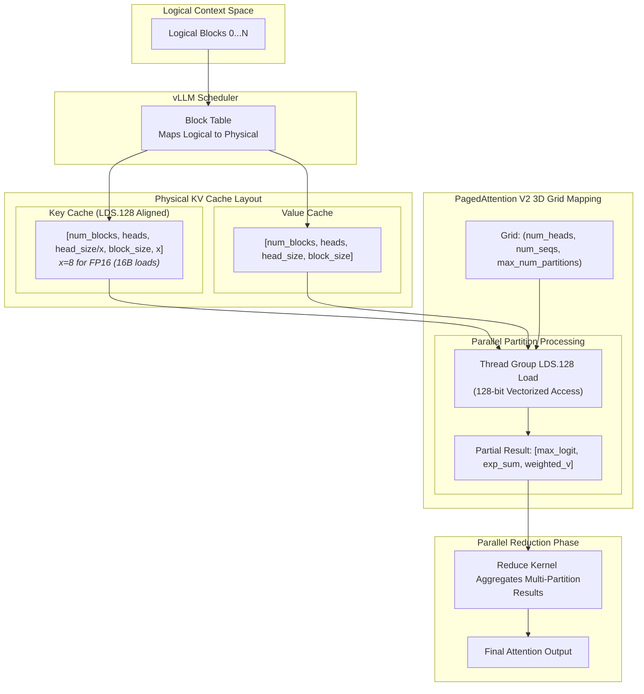

# Chapter 2: PagedAttention – Deep Dive into KV Cache Management

In Large Language Model (LLM) serving, the KV cache is the primary memory bottleneck. vLLM addresses this using **PagedAttention**, which treats GPU memory like virtual memory in operating systems. While V1 introduced the concept of paged memory, **PagedAttention V2** introduces significant architectural upgrades to handle long-context sequences, complex memory layouts, and quantization.

---

### The Architecture: Prefill vs. Decode

A critical distinction in vLLM's execution is how it handles the two phases of inference:

1.  **Prefill Phase (FlashAttention):** When the initial prompt is processed, all tokens are known simultaneously. vLLM typically uses **FlashAttention** or similar fused kernels for this phase. Since prompts are processed as contiguous chunks, the overhead of paged indexing is unnecessary. FlashAttention's tiling strategies are optimal for the high arithmetic intensity of prefill.
2.  **Decode Phase (PagedAttention):** During token-by-token generation, the sequence grows dynamically. PagedAttention is specifically designed for this "incremental" phase. It allows the KV cache for a single request to be scattered across non-contiguous physical memory blocks, preventing the need for expensive memory reallocations or "pre-allocating" for the maximum possible sequence length.

---

### PagedAttention V2: 3D Grid & Parallel Reduction

In PagedAttention V1, each thread block handled one head of one sequence. This became a bottleneck for long sequences because one thread block had to iterate through all KV blocks sequentially.

**PagedAttention V2** upgrades this to a **3D Grid Mapping**:
- **Grid Dimensions:** `(num_heads, num_seqs, max_num_partitions)`
- **Partitioning:** Long sequences are split into partitions (typically `PARTITION_SIZE = 512` tokens). Each partition is processed by a separate thread block in parallel.
- **Parallel Reduction:** A separate `reduce_kernel` aggregates the partial results (max logits, exp sums, and weighted values) from all partitions.

#### Shared Memory Pressure & `max_num_partitions`
As `max_num_partitions` increases to support longer contexts, the system faces **shared memory pressure**. If partial results are stored in shared memory for intra-block reduction or if the reduction kernel requires significant scratchpad space to aggregate results from many partitions, it can limit the number of active thread blocks per multiprocessor (occupancy). vLLM carefully tunes `max_num_partitions` to balance parallelism with shared memory availability.

---

### Hardware Constraints & Vectorization

To achieve maximum memory bandwidth, PagedAttention relies on **vectorized memory access (LDS.128)** and specific hardware alignments.

#### 1. Vectorization Alignment (`LDS.128`)
The kernel uses 16-byte (128-bit) loads to saturate the GPU's memory bus.
- **Alignment Requirement:** This requires that the `head_size` and the physical layout of the KV cache are multiples of the vector width. For FP16 (2 bytes), this means a vector of 8 elements (`x=8`).
- **Asymmetric Layouts:** 
    - **Keys** are stored as `[num_blocks, num_kv_heads, head_size/x, block_size, x]` to facilitate dot-product vectorization.
    - **Values** are stored as `[num_blocks, num_kv_heads, head_size, block_size]` to optimize for the weighted sum aggregation.

#### 2. The `head_size > 256` Limit
Modern models (like some large-scale MoE or specialized architectures) may use a `head_size` greater than 256. This introduces significant **block/warp limits**:
- **Register Exhaustion:** Each thread must track intermediate attention scores and values. Larger head sizes consume more registers, drastically reducing the number of warps that can run concurrently.
- **Shared Memory Limits:** PagedAttention often caches parts of the Query or Key vectors in shared memory. At `head_size > 256`, a single head might exceed the shared memory capacity of a single block, requiring the kernel to use slower global memory or specialized tiling that splits the head dimension across multiple warps.

---

### The Scheduler-Kernel Contract

The efficiency of PagedAttention depends on a strict "contract" between the Python-side scheduler and the CUDA kernels:

1.  **Block Table Management:** The scheduler is responsible for maintaining the `block_table`, which maps logical sequence indices to physical block IDs. The kernel assumes this table is already populated and valid.
2.  **Fixed Block Size:** The kernel is compiled with a specific `BLOCK_SIZE` (e.g., 8, 16, or 32). The scheduler must ensure that all physical allocations adhere to this size.
3.  **Partial Block Handling:** The scheduler communicates the `context_len` (total tokens) for each sequence. The kernel use this to determine which tokens in the "last" block are valid and which should be masked out.
4.  **Metadata Awareness:** The scheduler provides the `num_queries_per_kv` ratio for GQA/MQA, allowing the kernel to perform "virtual" head replication without duplicating KV data in memory.

By adhering to this contract, vLLM can offload complex memory management logic to Python while keeping the hot-path CUDA execution extremely lean and performant.

---

**Repository Context:** [vllm-project/vllm @ `f69ede49`](https://github.com/vllm-project/vllm/tree/f69ede495b3fe97a4b8f6c74d29627f735d46f33)
