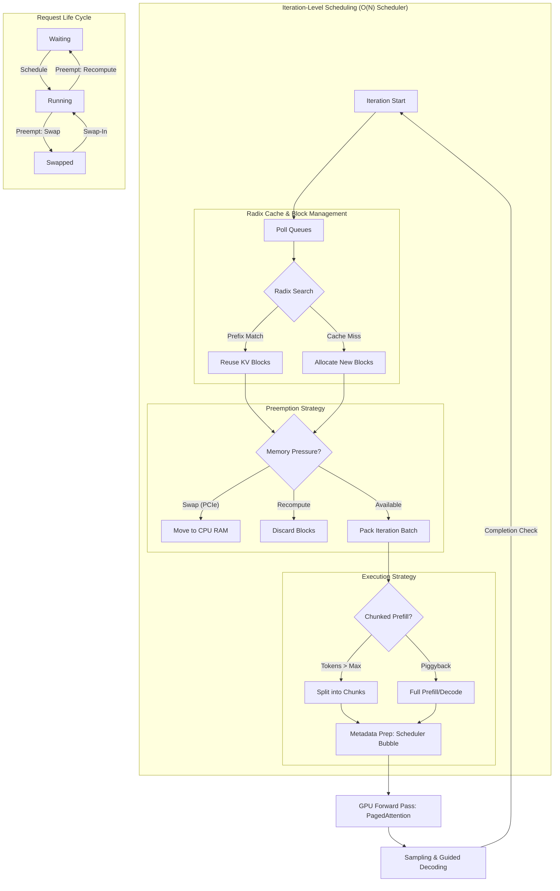

# Chapter 3: Continuous Batching and Iteration-Level Scheduling

Continuous batching is the core mechanism that allows vLLM to achieve high throughput by processing multiple requests simultaneously. Unlike static batching, which operates at the request level, continuous batching operates at the **iteration level**, making a new scheduling decision at each forward pass.

### Iteration-Level Scheduling & The Python "Bubble"

vLLM employs **iteration-level scheduling**, where the scheduler decides which requests (and how many tokens from each) to include in the next forward pass. However, because the scheduler is implemented in Python, it faces two significant performance hurdles:

1.  **O(N) Complexity:** As the number of concurrent requests ($N$) increases, the time spent in the scheduler's logic grows linearly. This includes scanning waiting queues, checking block availability, and managing priorities.
2.  **The GIL & Scheduler Bubble:** Python's Global Interpreter Lock (GIL) prevents the scheduler from running concurrently with other Python-based engine components. This creates a "scheduler bubble"—a period of GPU idleness where the model waits for the Python-based scheduler to prepare the next batch's metadata. 

**Metadata prep latency** is a key component of this bubble, involving the construction of complex tensors (like `input_metadata` and `sampling_metadata`) that describe the batch's structure to the CUDA kernels.

---

### Prefill/Decode Interference: Chunked Prefill

A major challenge is **prefill-decode interference**. Prefills (compute-bound) take much longer than decodes (memory-bound). Large prefills can "stall" decodes, spiking Inter-Token Latency (ITL). **Chunked Prefill** breaks large prefills into smaller chunks (e.g., 512 tokens), allowing decodes to be "piggybacked" onto prefill compute.

#### The SWA vs. ChunkedPrefill Conflict
Implementing Chunked Prefill becomes significantly more complex when combined with **Sliding Window Attention (SWA)**. These two features have conflicting state machines:
- **SWA** assumes a fixed-size cache window. Once the sequence length exceeds the window size $W$, old KV blocks are overwritten or discarded.
- **Chunked Prefill** processes a prompt in segments. 
The conflict arises when a chunk crosses a window boundary. The scheduler must carefully track which parts of a chunk contribute to the current window and manage the "sliding" of the KV cache across chunk boundaries, often requiring complex bookkeeping in the `BlockManager` to ensure that partial chunks don't leave the KV cache in an inconsistent state.

---

### Guided Decoding: Structural Constraints

Modern LLM applications often require structured outputs (e.g., valid JSON, specific Regex). vLLM integrates **Guided Decoding** (via libraries like **Outlines** and **XBNF**) directly into the scheduling and sampling pipeline.

#### Logit Masking and FSMs
Guided decoding works by maintaining a **Finite State Machine (FSM)** for each request. At each step:
1.  **Valid Token Identification:** The FSM identifies which tokens in the vocabulary are valid given the current state.
2.  **Logit Warping:** The engine applies a $-\infty$ mask to the logits of all invalid tokens *before* the sampling kernel runs.
3.  **Efficiency:** To maintain high throughput, vLLM caches the FSM states and uses optimized bitmasking to apply these constraints across the batch, ensuring that structural guarantees don't introduce significant latency.

---

### Advanced KV Cache: Radix Attention & Fragmentation

**Radix Attention** optimizes KV cache reuse (e.g., for multi-turn chat) by storing blocks in a radix tree.

#### Radix Cache Ghosting and Fragmentation
While powerful, the Radix Cache is susceptible to:
- **Ghosting:** This occurs when entries remain in the cache but are effectively unreachable or become "stale" due to subtle differences in system prompts or sampling parameters that prevent a match, yet they still occupy valuable physical blocks.
- **External Fragmentation:** Blocks are allocated and freed at different times for different requests. Over time, the physical memory becomes a "checkerboard" of free and used blocks. While PagedAttention handles this logically, the underlying memory can still suffer from fragmentation that makes it difficult to allocate large contiguous ranges of blocks for massive prefill requests, potentially triggering premature evictions.

---

### Speculative Decoding: The Reservation Cost

Speculative decoding uses a **draft model** to propose $K$ tokens, which are then verified by the **target model** in one step.

#### K+1 Over-Reservation & Starvation
To process a verification step, vLLM must reserve **$K+1$** slots in the KV cache for *every* sequence in the batch *before* the target model runs. 
- **Resource Starvation:** Even if the draft model is only 50% accurate, the engine must still lock $K+1$ blocks for every request. This "over-reservation" significantly reduces the effective batch size that can fit on the GPU, as blocks are held "just in case" they are needed for accepted tokens.
- **Throughput Tradeoff:** The benefit of generating multiple tokens per iteration is balanced against the cost of reduced concurrency due to this memory pressure.

---

### Preemption: Swap vs. Recompute

When memory is exhausted, vLLM must preempt requests:
1.  **Swap (PCIe-bound):** KV blocks move to CPU RAM. Cost is $T_{swap} = \frac{Size}{BW_{PCIe}}$. Best for large models or long contexts.
2.  **Recompute (Compute-bound):** KV blocks are discarded. Cost is $T_{recompute} = \frac{Tokens \times 2 \times Params}{FLOPS}$. Best for smaller models or slow interconnects.

---

### Implementation Map
- `vllm/core/scheduler.py`: Handles the O(N) scheduling loop and preemption.
- `vllm/core/block_manager.py`: Manages the Radix Cache, SWA windowing, and block allocation.
- `vllm/model_executor/layers/attention/`: Implements the CUDA kernels that consume the prepared metadata.
- `vllm/spec_decode/`: Manages the $K+1$ reservation logic for speculative execution.

---

**Repository Context:** [vllm-project/vllm @ `f69ede49`](https://github.com/vllm-project/vllm/tree/f69ede495b3fe97a4b8f6c74d29627f735d46f33)
