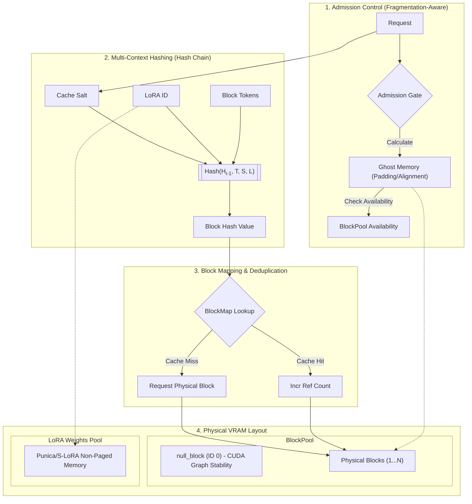

# Chapter 4: Memory Management

Memory management is the core innovation of vLLM. Traditional LLM serving allocated memory for the Key-Value (KV) cache contiguously for the maximum sequence length, leading to severe waste. vLLM's **PagedAttention** treats memory like virtual memory in operating systems, using fixed-size blocks and dynamic mapping.

This chapter explores how vLLM v1 manages its memory through block mapping, Multi-LoRA adapter pools, prefix caching, and fragmentation-aware admission control.

---

## 1. Logical vs. Physical Block Mapping

vLLM partitions the KV cache into fixed-size **blocks** (e.g., 16 tokens per block).

### Logical Blocks
From the model's perspective, the KV cache is a contiguous sequence of tokens. This view is partitioned into **logical blocks**. If block size is $B$, tokens $[0, B-1]$ are in Logical Block 0, $[B, 2B-1]$ in Logical Block 1, etc.

### Physical Blocks
Physical VRAM is pre-allocated as a pool of **physical blocks**. A physical block is a memory slot capable of storing the KV values for $B$ tokens for a specific set of layers and heads.

### The `null_block` (ID 0)
vLLM reserves **Physical Block 0** as a special `null_block`.
*   **Sliding Window Attention (SWA):** In SWA, blocks that fall outside the active window are not stored. vLLM fills these "skipped" logical slots in the block table with the `null_block`.
*   **CUDA Graph Stability:** By using a reserved `null_block` instead of re-shuffling tables, vLLM maintains stable block-table pointers across steps, which is critical for executing kernels within CUDA graphs.
*   **Reference Counting:** The `null_block` is never freed and its reference count is not maintained.

---

## 2. Multi-LoRA Memory Management

Managing multiple LoRA (Low-Rank Adaptation) adapters simultaneously introduces a second dimension of memory management. vLLM treats LoRA weights and KV caches as distinct but interrelated pools.

### Dedicated Adapter Pools
LoRA weights (A and B matrices) are stored in dedicated non-paged memory pools. This ensures that switching between adapters is a low-latency operation that doesn't trigger expensive VRAM re-allocations. vLLM leverages **Punica** and **S-LoRA** techniques to manage these pools efficiently.

#### Punica-style Batching
vLLM's `punica_wrapper` allows it to batch requests using different LoRA adapters into a single GPU forward pass. It uses specialized kernels that apply the unique LoRA weights for each sequence in the batch, effectively hiding the adapter-switching cost within the model execution.

### "LoRA Amnesia" Prevention
A common pitfall in prefix caching is "LoRA amnesia"—the failure to distinguish between identical prompts processed by different adapters. Since different LoRA adapters produce different KV values even for the same tokens, vLLM incorporates the **LoRA adapter identity** into the block hash. This ensures that requests using Adapter A never incorrectly hit KV cache blocks generated by Adapter B.

---

## 3. Prefix Caching, Salts, and the Hash Collision Reality

vLLM v1 uses a Hash Chain to identify blocks for reuse. The hash of logical block $i$ is:
$$H_i = Hash(H_{i-1}, \text{Tokens in Block } i, \text{Extra Keys})$$

### The `cache_salt` and Tenant Isolation
In multi-tenant or shared environments, privacy and security are paramount. vLLM provides a `cache_salt` parameter:
*   **Namespace Isolation:** The salt is injected into the hash of the first block of a request. 
*   **Tenant Security:** This creates a unique "namespace" for the request's cache. Even if two different users (tenants) send the exact same prompt, they cannot reuse each other's cache unless they share the same salt. This prevents timing-based side-channel attacks where an adversary could infer cached content.

### Hash Collision Reality
The assumption that 64-bit or 128-bit hashes never collide is a "delusion" in high-scale systems. While statistically rare, a collision could lead to incorrect model outputs or system crashes. vLLM mitigates this by:
1.  Using high-entropy hash functions (e.g., SHA-256 or xxHash).
2.  Incorporating `cache_salt`, LoRA identity, and Multi-Modal features into the hash to increase entropy.
3.  Architecting the `BlockHashToBlockMap` to handle potential collisions gracefully through tiered lookups.

### Append-Only Deduplication
Unlike v0, vLLM v1's prefix cache is **append-only** regarding block IDs.
*   **De-duplication Choice:** If a request generates a block that is identical to one already in the cache, vLLM v1 does **not** immediately merge them into a single physical block if they are already part of separate active sequences.
*   **Stability Over Perfect Compression:** This "failure" to deduplicate is an intentional trade-off. By allowing multiple physical blocks per hash, vLLM ensures that block IDs remain constant for a request's lifetime. This stability is mandatory for high-performance CUDA graph kernels that cannot tolerate shifting memory addresses mid-execution.

---

## 4. Fragmentation-Aware Admission Control

vLLM v1 replaces the complex CPU-swapping logic of earlier versions with **Fragmentation-Aware Admission Gates**.

### The "Admission Gate"
Before a request is admitted to the `running` state, the scheduler performs a "worst-case" memory check. This check is not a simple token count; it is a **fragmentation-aware** calculation.

### "Ghost" Memory and Alignment
The gate accounts for memory that is reserved but not storing tokens, known as **Ghost Memory**:
*   **Layer Alignment Padding:** Hardware requirements often force blocks to be aligned to specific byte boundaries (e.g., 1024 bytes), wasting space if the actual KV data is smaller.
*   **Group Size Padding:** When model layers are grouped (e.g., to handle DeepSeek-V4 MLA), some groups may have inactive slots that still occupy physical space.

### Recomputation over Swapping
If VRAM is exhausted, vLLM **preempts** requests by freeing their blocks and moving them back to the `waiting` queue. Instead of swapping to CPU (which suffers from PCI-e bottlenecks), vLLM simply **recomputes** the KV cache when the request is re-admitted. In modern LLM serving, GPU compute is often cheaper and faster than moving data over the bus.

---

## 5. Code Architecture Pointers

Explore these files in `vllm/v1/core` for implementation details:

*   **`block_pool.py`**: Implementation of `BlockPool` and `BlockHashToBlockMap`. Handles `null_block` and the multiple-block-per-hash logic.
*   **`kv_cache_utils.py`**: Contains the hashing logic (including LoRA and `cache_salt` integration) and ghost memory padding calculations.
*   **`kv_cache_manager.py`**: Orchestrates the admission gates and coordinates with the scheduler.
*   **`sched/scheduler.py`**: Manages the request queues and triggers preemption based on the admission gate's feedback.

---

## Summary

vLLM v1 memory management prioritizes **stability and isolation**. By acknowledging the reality of hash collisions, utilizing `cache_salt` for tenant security, and accounting for "ghost" memory in its admission gates, vLLM achieves a robust system that is both highly performant and secure in production environments.

---

**Repository Context:** [vllm-project/vllm @ `f69ede49`](https://github.com/vllm-project/vllm/tree/f69ede495b3fe97a4b8f6c74d29627f735d46f33)
