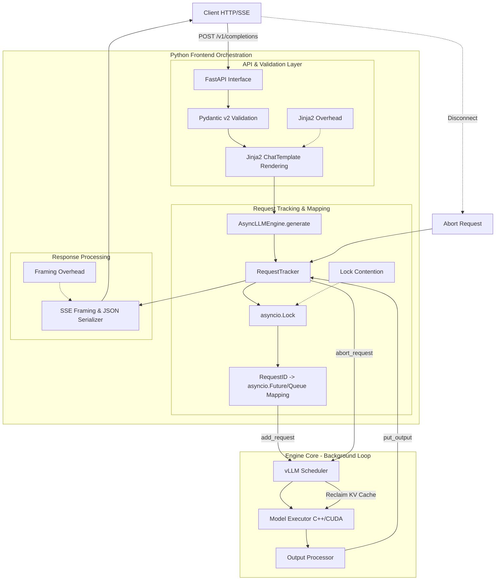

# Chapter 5: The Python Frontend - Orchestration and API Layers

The Python frontend in vLLM is the "brain" that coordinates the high-performance "muscles" (C++/CUDA). While it provides a user-friendly OpenAI-compatible API, it is a complex asynchronous system where performance bottlenecks—ranging from lock contention to event loop starvation—must be rigorously managed to maintain high throughput.

---

### The Asynchronous Foundation: `asyncio` and FastAPI

vLLM's frontend is built on `asyncio` and utilizes `uvloop` for high-performance event loop management. However, the integration with FastAPI introduces specific architectural risks.

#### FastAPI Threadpool Starvation
FastAPI handles `def` (synchronous) and `async def` (asynchronous) routes differently.
- **`async def`**: Runs directly on the event loop. If these routes perform CPU-intensive work (like complex tokenization or heavy JSON processing), they block the loop and spike tail latency.
- **`def`**: Runs in an external threadpool. If the frontend relies on synchronous dependencies (e.g., certain storage backends or legacy libraries), the default FastAPI threadpool can quickly become **starved**. This leads to a bottleneck where new requests are queued before they even reach vLLM's engine logic.

vLLM mitigates this by keeping the API routes `async` and offloading blocking work to the engine's background loop, but the overhead of managing these concurrent tasks remains.

---

### Request Life-cycle Bottlenecks

A request travels through several layers before hitting the GPU. Each layer introduces potential overhead.

#### 1. Pydantic v2 Performance
vLLM utilizes **Pydantic v2** for request validation. While v2 features a Rust-based core and is significantly faster than v1, the shear volume of validation still impacts performance. At high Requests Per Second (RPS), the constant instantiation of complex models and the associated validation logic become a non-trivial CPU cost, contributing to "event loop lag."

#### 2. Jinja2 ChatTemplate Overhead
Most modern LLMs use complex chat templates (e.g., ChatML, Llama-3). Converting a list of messages into a single prompt string involves **Jinja2** rendering. 
- **Parsing Overhead**: Jinja2's `Template.render()` can be slow, especially with the sophisticated logic required for tool-calling or multi-modal inputs.
- **Redundant Processing**: Re-parsing and re-rendering templates for every request (or every turn in a conversation) adds millisecond-level overhead that aggregates under load.

#### 3. SSE Framing Overhead
For streaming requests, vLLM uses **Server-Sent Events (SSE)**. Every single generated token must be:
1. Wrapped in a JSON object.
2. Stringified.
3. Framed with `data: ` and `\n\n`.
This "framing" process is repeated for every token across thousands of concurrent streams. The cumulative CPU time spent on string manipulation and JSON serialization can exceed the actual logic of the request tracker.

---

### Request Tracking and Lock Contention

The `RequestTracker` is the bridge between the API layer and the engine. It maps `request_id`s to `asyncio.Future`s or `AsyncGenerator`s.

#### Scalability and Locks
To ensure thread-safety and consistency across the asynchronous boundaries, the `RequestTracker` utilizes internal locks (e.g., `asyncio.Lock`). 
- **Contention**: Under extreme concurrency, the time spent waiting for these locks can become a bottleneck. As the engine loop and multiple API worker tasks all attempt to update the state of the tracker (adding requests, updating tokens, or marking completions), the contention limits the effective throughput of the frontend.

---

### Cancellation Race Conditions and Zombie Generations

Correctly handling client disconnections is one of the most difficult challenges in the frontend.

#### The "Zombie" Problem
When a client cancels an SSE connection, the frontend must signal the engine to stop generation and reclaim the **KV cache** slots immediately. However, several race conditions can occur:
- **Late Cancellation**: If the engine has already started a new iteration (batch) for a request just as the cancellation arrives, it may continue generating for that request for one or more steps.
- **Zombie Generations**: If the cancellation signal is dropped or delayed due to event loop starvation, the engine continues to generate "phantom" tokens. This **leaks KV cache** and wastes GPU compute, as the results will never be sent to the client.

vLLM implements complex logic to ensure that cancellation propagates through the `RequestTracker` to the scheduler, but high-load scenarios can still expose edge cases where resources are not reclaimed instantly.

---

### The "GIL-free" Myth

While the heavy lifting happens in CUDA kernels (outside the GIL), the **Global Interpreter Lock** still haunts the orchestration layer.
- **Orchestration Overhead**: Managing the `RequestTracker`, updating Pydantic models, and SSE framing all compete for the GIL.
- **GC Pressure**: The creation of thousands of short-lived Python objects per second increases **Garbage Collection (GC)** activity. GC pauses ("stop-the-world") directly translate into P99 latency spikes in the API response.

---

### Summary of the Request Flow

1.  **Ingress**: FastAPI receives the HTTP request; Pydantic v2 validates the schema.
2.  **Template**: Jinja2 renders the chat template into a prompt string.
3.  **Tracker**: `RequestTracker` acquires a lock and registers the request.
4.  **Submission**: The prompt is tokenized and pushed to the engine.
5.  **Iteration**: The engine generates tokens; the tracker is notified (lock acquired).
6.  **Egress**: Tokens are SSE-framed and sent; if the client disconnects, a cancellation race begins to reclaim the KV cache.

---

**Repository Context:** [vllm-project/vllm @ `f69ede49`](https://github.com/vllm-project/vllm/tree/f69ede495b3fe97a4b8f6c74d29627f735d46f33)
