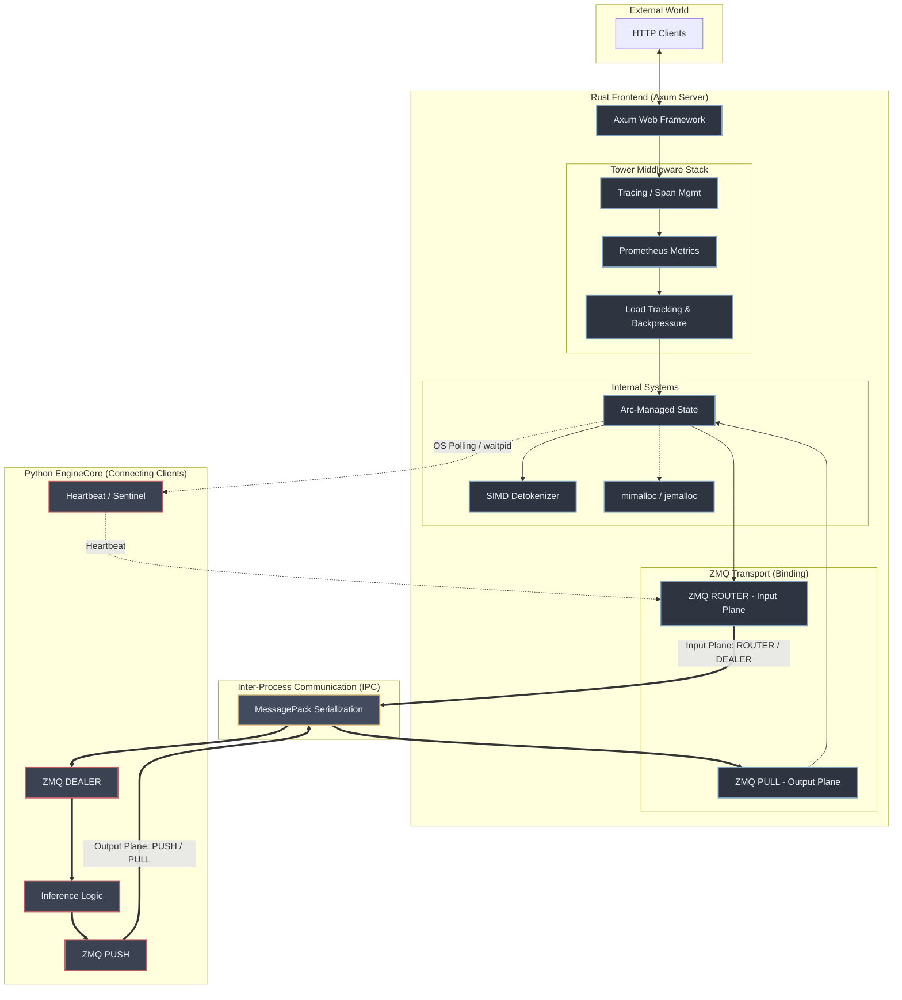

# Chapter 6: The Rust Frontend - Architectural Deep Dive



In high-throughput LLM serving, the "front-of-house" is often the bottleneck. While Python is excellent for model orchestration and deep learning research, its Global Interpreter Lock (GIL) and garbage collection (GC) pauses can introduce significant tail latency (P99) when handling thousands of concurrent requests.

vLLM addresses this by introducing a high-performance **Rust Frontend**. This chapter explores the architectural reality of this subsystem, moving beyond simple analogies to understand how it achieves sub-millisecond overhead through rigorous process management, asynchronous IPC, and optimized memory handling.

---

### The Binding Server: Stability and Backpressure

A fundamental design choice in vLLM is that the **Rust Frontend acts as the Server (Binding)** while the **Python EngineCore acts as the Client (Connecting)**.

-   **Socket Stability:** By having the Rust process `bind` to IPC/TCP endpoints, the communication sockets remain stable even if a Python engine crashes or restarts.
-   **ZMQ High Water Marks (HWM):** To prevent "backpressure blindness," vLLM utilizes ZeroMQ's High Water Mark settings. By tuning `SNDHWM` and `RCVHWM`, the system ensures that if an engine falls behind, the frontend stops accepting new requests or buffers them in a controlled manner, preventing memory exhaustion from unbounded message queues.
-   **Ephemeral Clients:** This pattern treats Python engines as ephemeral workers that can be scaled or replaced without tearing down the public-facing HTTP server.

### IPC Architecture: Decoupled Data Planes

To avoid the performance pitfalls of synchronous communication, vLLM separates interaction into two distinct "planes."

#### 1. Control/Input Plane (ROUTER/DEALER)
The frontend uses a `ROUTER` socket to dispatch requests to specific engines.
-   **Identity-Based Routing:** The `ROUTER` socket allows the frontend to explicitly address individual `EngineCore` instances via their `EngineId`.
-   **Asynchronous Request-Response:** By using `ROUTER/DEALER`, the frontend can send multiple requests without waiting for a reply, enabling high-concurrency multiplexing and avoiding head-of-line blocking.

#### 2. Asynchronous Output Data Plane (PUSH/PULL)
The streaming of tokens, logprobs, and metrics happens over a **decoupled output plane**.
-   **Fan-In Efficiency:** Engines send data via `PUSH` sockets which are collected by the frontend's `PULL` socket.
-   **Non-Blocking Streams:** Because the output plane is decoupled, a backup in the token streaming logic (e.g., a slow client) won't prevent the frontend from receiving new inference requests on the input plane.

### The `tower` Middleware Stack: Composable Observability

The Rust frontend leverages the `tower` ecosystem to build a robust, composable request handling pipeline. This moves logic out of the core handlers and into reusable layers:

-   **`TraceLayer` (tracing):** Structured logging and span management for every request, integrated with `tracing-subscriber`.
-   **Metrics Middleware:** Integration with **Prometheus** for real-time tracking of request rates, latencies, and active request counts.
-   **Load Tracking:** Custom middleware to monitor engine saturation and apply backpressure at the HTTP layer before requests even reach the ZMQ queues.

### Memory and Serialization: Beyond the Myths

High performance in Rust requires moving beyond basic abstractions to address the "hidden" costs of system interaction.

#### The MessagePack "Zero-Copy" Myth
While vLLM uses **MessagePack** for binary serialization, it is important to debunk the "zero-copy" myth. Unlike formats like Cap'n Proto, MessagePack is a tagged format that **requires a deserialization pass**. While significantly faster than JSON, it still incurs CPU overhead and memory allocations when converting wire bytes into Rust structs. vLLM minimizes this by using the `bytes` crate to share underlying buffers where possible, but the deserialization cost remains a factor in the overall latency budget.

#### Allocator Excellence: `mimalloc`
To combat memory fragmentation and improve performance in long-running async workloads, the Rust frontend uses **`mimalloc`** (or alternatively `jemalloc`). These high-performance allocators are significantly more efficient than the default system allocator at handling the high-frequency, small-object allocations typical of asynchronous web servers and IPC message processing.

### Detokenization: The SIMD Frontier

The final step of inference—converting token IDs back into strings—can become a significant bottleneck, especially with large vocabularies and high throughput.
-   **SIMD Acceleration:** vLLM's Rust frontend utilizes **SIMD (Single Instruction, Multiple Data)** instructions for byte-level decoding and UTF-8 validation. This ensures that detokenization scales with hardware capabilities rather than becoming a single-threaded CPU bottleneck that increases tail latency.

### Process Management: Polling vs. Heartbeats

Ensuring the reliability of the Python-Rust boundary requires multiple layers of health monitoring.

1.  **Heartbeats (Application Level):** Engines periodically send small heartbeat messages over ZMQ to signal that the Python event loop is alive.
2.  **Polling (OS Level):** The frontend's `ManagedEngineHandle` performs non-blocking **OS-level polling** using `try_wait` (wrapping `waitpid` with `WNOHANG`). This is the definitive source of truth for process health.
3.  **Sentinel Robustness:** While engines send an `ENGINE_CORE_DEAD_SENTINEL` on controlled exits, OS-level polling ensures that `SIGKILL` or segmentation faults are detected immediately.

### Axum State and the Graceful Shutdown Pattern

The web layer is built on **Axum**, utilizing `Arc` (Atomic Reference Counting) to manage application state. vLLM implements a graceful shutdown loop that ensures all in-flight requests are completed:

```rust
pub async fn shutdown(mut self: Arc<Self>, deadline: Instant) {
    loop {
        match Arc::try_unwrap(self) {
            Ok(state) => {
                state.chat.shutdown().await?;
                return Ok(());
            }
            Err(state_back) => {
                self = state_back; 
            }
        }
        sleep_until(poll_interval).await;
    }
}
```
Only when the `Arc` reference count drops to 1 (meaning no active request handlers are holding the state) can the backend connections be closed cleanly.

---

### References in Codebase

-   `rust/src/server/src/state.rs`: Graceful shutdown logic.
-   `rust/src/server/src/middleware/`: Implementation of `tower` middleware.
-   `rust/src/engine-core-client/src/transport.rs`: ZMQ transport and socket management.
-   `rust/src/tokenizer/src/byte_level_decode.rs`: SIMD-optimized detokenization logic.
-   `rust/src/cmd/Cargo.toml`: Configuration for `mimalloc`.

---

**Repository Context:** [vllm-project/vllm @ `f69ede49`](https://github.com/vllm-project/vllm/tree/f69ede495b3fe97a4b8f6c74d29627f735d46f33)
