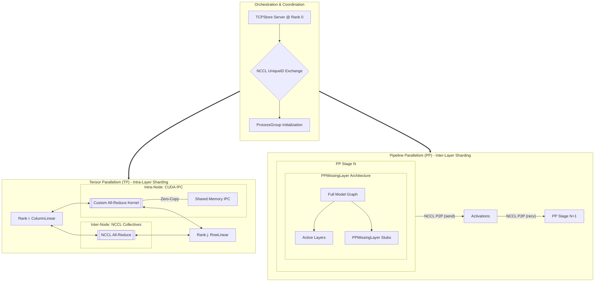

# Chapter 7: Distributed Execution and Parallelism

When model parameters exceed the memory capacity of a single accelerator, or when inference latency must be reduced beyond the limits of a single device, vLLM employs distributed execution. This chapter details the architectural components that enable multi-GPU orchestration, specifically focusing on Tensor Parallelism (TP), Pipeline Parallelism (PP), and the Static Executor Model.

## 1. Orchestration: The Static Executor Model

vLLM utilizes a **Static Executor Model** driven by `VllmConfig`. Unlike dynamic frameworks, vLLM fixes the parallelism strategy (TP and PP sizes) at initialization to optimize the execution graph and memory allocation.

### Ray vs. Multiprocessing
*   **Multiprocessing (`mp`)**: Default for single-node execution. Spawns one process per GPU.
*   **Ray (`ray`)**: Used for multi-node clusters or advanced resource management. It is often required for Pipeline Parallelism spanning multiple nodes.

### Initialization and `torch.distributed.TCPStore`
To initialize collective communication without external orchestrators like MPI, vLLM uses a CPU-based coordination layer:
1.  **Master Discovery**: Rank 0 (or the executor) starts a `TCPStore` server.
2.  **Unique ID Exchange**: All workers connect to this `TCPStore` to exchange NCCL `UniqueId`s and sync addresses.
3.  **Group Initialization**: This allows workers to form `ProcessGroup`s for both TP and PP stages efficiently.

## 2. Parallelism Strategies

### Tensor Parallelism (TP)
TP shards individual layers (Megatron-LM style) across multiple GPUs. It requires high-bandwidth interconnects like NVLink.
*   **Intra-Node IPC**: vLLM’s Custom All-Reduce uses **CUDA IPC** for sub-millisecond synchronization within a node, bypassing NCCL kernel overhead.
*   **Inter-Node NCCL**: When TP spans across nodes, it reverts to NCCL, which is subject to network latency.

### Pipeline Parallelism (PP)
PP shards the model by **layers**, where different GPUs handle different stages of the model's depth.
*   **PPMissingLayer**: vLLM instantiates the full model on all ranks but replaces layers not assigned to the current rank with `PPMissingLayer` stubs. This ensures a consistent model structure while only executing relevant segments.
*   **Point-to-Point Comms**: Activations are passed between PP stages using `send`/`recv` primitives.

## 3. KV Cache & PP Fragmentation

In a Pipeline Parallel setup, the **KV Cache is distributed across stages**.
*   **Local Management**: Each PP stage only allocates and manages KV cache blocks for the specific layers it hosts.
*   **Block Coordination**: While the cache is physically fragmented, the central engine’s `BlockManager` tracks block mappings across the pipeline to ensure cross-stage consistency.
*   **Efficiency**: PP reduces the per-GPU weight memory, allowing for more KV cache blocks per stage compared to high-TP configurations, at the cost of pipeline bubbles.

## 4. Summary of Distributed Communication
*   **Intra-Node**: Direct memory access via IPC for TP.
*   **Cross-Node**: NCCL-based collectives for both TP and PP stage-to-stage transfers.
*   **Graph Capture**: Both TP and PP operations are captured in CUDA Graphs to minimize CPU overhead.

---

**Repository Context:** [vllm-project/vllm @ `f69ede49`](https://github.com/vllm-project/vllm/tree/f69ede495b3fe97a4b8f6c74d29627f735d46f33)
