# Chapter 8: Hardware Acceleration - CUDA, Triton, and Specialized Kernels

```mermaid
graph TD
    subgraph Dispatch ["Kernel Dispatch &amp; Programming Model"]
        Triton["Triton Dispatch<br/>(Block-level DSL)"]
        CuTe["CuTe Layouts<br/>(Algebraic Tiling)"]
        CUDA["CUDA C++<br/>(Warp Primitives)"]
    end

    subgraph Memory ["Data Movement Architecture"]
        Global[("Global Memory")]
        Shared[["Shared Memory / L1"]]
        Regs[["Register File"]]
        
        CP_Async["cp.async / TMA<br/>(Asynchronous Global &rarr; Shared)"]
        Tiling["Conflict-free Swizzling<br/>(Bank Alignment)"]
        
        Global --> CP_Async
        CP_Async --> Shared
        Shared --> Tiling
        Tiling --> Regs
    end

    subgraph Execution ["Hardware Execution Units"]
        SIMT["Independent Thread Scheduling<br/>(Volta+ PC per Thread)"]
        MMA["Tensor Cores (MMA)<br/>(Matrix Multiplication Units)"]
        Warp["Warp-level Sync<br/>(&#95;&#95;shfl&#95;sync, &#95;&#95;barrier)"]
        
        Regs --> MMA
        SIMT --> Warp
        Warp --> MMA
    end

    Triton -.-> CP_Async
    CuTe -.-> Tiling
    CUDA -.-> Warp
```



While high-level orchestration happens in Python, vLLM's performance is fundamentally built on low-level hardware acceleration. This chapter explores the diverse landscape of kernel development in vLLM, from manual CUDA C++ to modern DSLs like Triton and abstractions like Cutlass/CuTe.

## 1. Multi-Architecture Execution: NVIDIA Warp32 vs. AMD Wave64

In the GPU programming model, threads are executed in groups that share a single instruction stream.

- **NVIDIA (Warp32):** Threads are grouped into **Warps** of 32. All threads in a warp execute the same instruction simultaneously. vLLM uses warp-level primitives like `__shfl_sync` for ultra-fast data exchange without shared memory.
- **AMD (Wave64/32):** AMD GPUs (ROCm) use **Wavefronts**. Historically, these were always 64 threads (Wave64). Modern architectures like RDNA3 (gfx1100) support both Wave32 and Wave64.
- **vLLM's Abstraction:** vLLM handles these differences through conditional compilation and abstraction layers. For example, `csrc/rocm/q_gemm_rdna3_wmma.cu` specifically targets AMD's WMMA (Wavefront Matrix Multiply-Accumulate) instructions.

## 2. Tensor Cores and MMA (Matrix-Multiply Accumulate)

Modern AI performance relies on specialized hardware units called **Tensor Cores**. Unlike traditional CUDA cores that perform scalar operations, Tensor Cores operate on entire matrices in a single instruction.

### MMA Instructions
NVIDIA GPUs use **MMA (Matrix-Multiply Accumulate)** instructions. For example, the `mma.m16n8k16` instruction multiplies a $16 \times 16$ matrix by a $16 \times 8$ matrix and accumulates into a $16 \times 8$ matrix.
- **Throughput:** Tensor Cores provide an order of magnitude higher throughput than standard SIMT operations for half-precision (FP16/BF16) and integer (INT8/INT4) data.
- **vLLM Usage:** vLLM leverages these via the **Cutlass** library and specialized kernels like **Marlin** or **Machete** (specifically for Hopper SM90a).

## 3. Asynchronous Data Movement: `cp.async` and TMA

One of the biggest bottlenecks in GPU computing is the latency and register pressure involved in moving data from Global Memory (VRAM) to Shared Memory (SRAM).

- **The Old Way:** Threads load data into registers, then store it from registers to shared memory. This consumes precious registers and adds latency.
- **The Modern Way (`cp.async`):** Introduced in the **Ampere** architecture (SM 80+), `cp.async` allows the hardware to move data directly from Global to Shared memory, bypassing the register file.
- **Hopper's TMA (Tensor Memory Accelerator):** The **Hopper** architecture (SM 90+) further optimizes this with a dedicated hardware unit (TMA) that handles multi-dimensional data movement asynchronously, freeing up the SM (Streaming Multiprocessor) to perform compute while data is in flight.

## 4. Modern Kernel DSLs: Triton

Writing manual CUDA C++ is time-consuming and error-prone. vLLM increasingly uses **Triton**, a Python-based DSL that compiles to high-performance PTX code.

- **Why Triton?** It provides a middle ground: easier to write than CUDA but faster than PyTorch. It automatically handles tiling, memory coalescing, and shared memory management.
- **Execution Model:** Triton operates on **blocks** of data rather than individual threads. This higher-level abstraction allows for rapid prototyping of kernels like FlashAttention or specialized activation functions.
- **vLLM Integration:** Look at `vllm/triton_utils/` and various Triton-based models in vLLM that use it for dynamic quantization or custom fused ops.

## 5. Abstractions for Complexity: Cutlass and CuTe

For complex GEMMs (General Matrix Multiplications) and MoE (Mixture of Experts) kernels, vLLM uses **NVIDIA Cutlass**.

- **Cutlass 3.x and CuTe:** The latest versions of Cutlass introduce **CuTe**, a layout abstraction library.
- **CuTe Layouts:** Instead of manual index arithmetic (e.g., `row * stride + col`), CuTe uses a formal algebraic representation of layouts and tensors. This allows developers to express complex tiling and swizzling patterns in a type-safe way.
- **Usage in vLLM:** vLLM uses Cutlass/CuTe for:
    - **Marlin/Machete:** High-performance 4-bit quantized GEMMs.
    - **MoE Kernels:** Expert-specialized MXFP8 blockscaled grouped kernels (`csrc/moe/mxfp8_moe/`).
    - **FP8 Scaled MM:** High-performance kernels for Hopper and Blackwell architectures.

## 6. Quantization Context: AWQ and GPTQ Dequantization

vLLM provides first-class support for quantized models (AWQ, GPTQ, Marlin). The core challenge is performing **on-the-fly dequantization**.

### Dequantization Logic
In an AWQ or GPTQ kernel, the weights are stored in a low-precision format (e.g., 4-bit integers). During the GEMM, the kernel must:
1. **Unpack:** Extract the 4-bit values from packed 32-bit integers (e.g., 8 weights per `int32`).
2. **Scale and Shift:** Apply a floating-point scale and zero-point (offset) to convert the integer back to FP16 or BF16.
    - Formula: $W_{fp16} = (W_{int4} - zero) \times scale$
3. **Cache Scales/Zeros:** To minimize VRAM access, scales and zero-points are often loaded into **Shared Memory** or cached in registers if the tiling strategy allows.

```cpp
// Conceptual dequantization in a CUDA kernel
uint32_t packed_weight = weight_ptr[idx];
#pragma unroll
for (int i = 0; i < 8; ++i) {
    int val = (packed_weight >> (i * 4)) & 0xF; // Extract 4 bits
    half dequant_val = __half((float(val) - zero_ptr[g]) * scale_ptr[g]);
    // ... use dequant_val in MMA ...
}
```

By fusing dequantization directly into the GEMM kernel, vLLM avoids the massive memory bandwidth penalty of storing full-precision weights in VRAM.

---

### References in Codebase

- `csrc/quantization/marlin/`: Cutlass-based 4-bit quantized kernels.
- `csrc/moe/mxfp8_moe/`: Cutlass 3.x/CuTe based MoE implementations.
- `csrc/libtorch_stable/quantization/w8a8/cutlass/`: Scaled MM kernels using Cutlass.
- `csrc/rocm/`: AMD-specific kernel implementations.
- `vllm/model_executor/layers/quantization/`: Python side of quantization logic.

---

**Repository Context:** [vllm-project/vllm @ `f69ede49`](https://github.com/vllm-project/vllm/tree/f69ede495b3fe97a4b8f6c74d29627f735d46f33)
