# Chapter 9: Model Execution and Hardware Abstraction

```mermaid
flowchart TB
    subgraph MR ["ModelRunner Execution & Hardware Abstraction"]
        direction TB
        Start(["execute_model"]) --> Input["BatchExecutionDescriptor"]
        Input --> Meta["Metadata Management: SamplingMetadata, AttentionMetadata"]
        
        subgraph MM ["Multi-Modal Insertion"]
            direction TB
            Encoder["Vision Encoder"] --> Proj["Projector"]
            Proj --> Interleave["Interleave Features &#64; Placeholder Tokens"]
        end
        
        Meta --> MM_Check{"Is MM?"}
        MM_Check -->|Yes| Encoder
        MM_Check -->|No| Embed["Embedding Lookup"]
        
        subgraph CUDAGraph ["CUDA Graph: FULL vs PIECEWISE"]
            direction TB
            Path{"Capture Mode"}
            Path -->|FULL| Full["Full Graph Capture"]
            Path -->|PIECEWISE| Piece["Graph Splitting / PiecewiseBackend"]
            Full & Piece --> Static["Static Buffer I/O Synchronization"]
        end
        
        Interleave --> Path
        Embed --> Path
        Static --> Backend["AttentionBackend: Dispatch to FlashAttn/XFormers/FlashInfer"]
        Backend --> Sampler["Logit Warping & Sampling"]
    end

    subgraph SD ["Speculative Decoding Workflow"]
        direction TB
        Proposer["Proposer: K-step Draft Loop"] --> Verify["Target: Single Verification Pass"]
        Verify --> Rejection["Rejection Sampling"]
        
        subgraph SDSync ["Multi-Step State Sync"]
            direction TB
            KVSync["KV Cache Rollback"]
            HiddenSync["Hidden State Feedback"]
        end
        
        Rejection --> KVSync & HiddenSync
    end

    Sampler -.-> Proposer
    KVSync & HiddenSync -.->|State Update| Start
```

The Model Runner is the core orchestrator of the model's forward pass, bridging the engine's high-level scheduling decisions with low-level kernel execution and hardware management. It ensures that inputs are correctly formatted for the hardware, manages optimized execution paths like CUDA Graphs, and handles specialized workflows such as Multi-Modal processing and Speculative Decoding.

## The Model Execution Entry Point: `execute_model`

In the vLLM architecture, the primary entry point for execution is the `execute_model` method. This method is responsible for:

1.  **Input Consumption:** Taking a `BatchExecutionDescriptor` which encapsulates the state of the current iteration (token IDs, positions, etc.).
2.  **Metadata Management:** Handling the `SamplingMetadata` required for logit warping, temperature scaling, and penalty application after the forward pass.
3.  **Kernel Dispatch:** Coordinating the invocation of the model's forward pass, whether through standard eager execution or optimized CUDA Graph replay.

## Multi-Modal Feature Insertion

vLLM supports Multi-Modal (MM) models by treating non-text modalities (like images) as sequences of features that are interleaved with text token embeddings.

-   **Vision Encoders and Projectors:** For models like LLaVA or Qwen-VL, images are first processed by a vision encoder (e.g., CLIP) to extract visual features. These features are then mapped to the language model's embedding dimension via a projector (typically a linear layer or MLP).
-   **Placeholder Tokens:** The input text contains special placeholder tokens (e.g., `<image>`) that signal where the multi-modal features should be inserted.
-   **Feature Interleaving:** During the embedding lookup stage, the Model Runner ensures that the text embeddings and the extracted MM features are correctly concatenated or substituted according to the placeholder positions, creating a unified sequence for the transformer layers.

## The `AttentionBackend` Abstraction

To support various hardware and performance optimizations, vLLM utilizes an `AttentionBackend` abstraction layer. This allows the model logic to remain agnostic of the specific attention implementation.

-   **Backend Registry:** vLLM maintains a registry of backends (e.g., `FLASH_ATTN`, `XFORMERS`, `FLASHINFER`, `TRITON_ATTN`).
-   **Unified Interface:** The `AttentionBackend` (and its metadata class `AttentionMetadata`) provides a common interface for:
    -   KV cache allocation and management.
    -   Execution of the attention kernel (dispatching to FlashAttention, XFormers, or FlashInfer).
    -   Handling different sequence types (prefill vs. decode) and jagged batch structures.
-   **Dynamic Dispatch:** The Model Runner selects the appropriate backend at initialization based on hardware capability (e.g., CUDA capability 8.0+ for FlashAttention) and user configuration.

## Static Buffer Management and CUDA Graphs

CUDA Graphs are used to eliminate the CPU-side overhead of launching individual kernels by recording a sequence of kernel launches and replaying them.

-   **Graph Capture:** vLLM captures graphs for various batch shapes (number of tokens, requests, and max sequence lengths).
-   **Static Buffers:** Since CUDA Graphs require fixed memory addresses, vLLM allocates "static" input and output buffers.
-   **Copy Overhead:** Before replaying a graph, the Model Runner must copy the dynamic batch data into these static buffers. While this introduces a small copy overhead, it is significantly outweighed by the reduction in kernel launch latency for small batch sizes and low-latency decoding.

## Speculative Decoding: Multi-Step State Sync

Speculative Decoding accelerates inference by using a small "proposer" model to guess tokens and a larger "target" model to verify them.

-   **Proposer Multi-Step Loop:** The proposer model may run for multiple steps (e.g., $k$ steps) to generate a sequence of draft tokens. This is often implemented as a specialized loop within the Model Runner or a dedicated Speculator.
-   **Verification Pass:** The target model performs a single forward pass to evaluate all $k$ proposed tokens in parallel.
-   **State Synchronization:** Maintaining consistency between the proposer and target models is critical:
    -   **KV Cache Sync:** If the target model rejects some proposed tokens, the KV caches of both models must be "rolled back" to the last accepted position.
    -   **Hidden States:** Some speculators (like EAGLE) use hidden states from the target model to improve the quality of future proposals, requiring a feedback loop between the two models.
-   **Rejection Sampling:** The final token selection is performed by a specialized sampler that compares the probabilities from both models to ensure the output distribution remains identical to the target model.

## Platform Abstraction Layer

The [`vllm/platforms/`](https://github.com/vllm-project/vllm/blob/f69ede495b3fe97a4b8f6c74d29627f735d46f33/vllm/platforms/) directory provides a unified interface (`Platform` and `Device` classes) that abstracts hardware-specific APIs (CUDA, HIP, XLA). This ensures that the core Model Runner logic remains largely consistent across NVIDIA GPUs, AMD GPUs, and TPUs.

---

### Key Source References
-   [`vllm/v1/worker/gpu_model_runner.py`](https://github.com/vllm-project/vllm/blob/f69ede495b3fe97a4b8f6c74d29627f735d46f33/vllm/v1/worker/gpu_model_runner.py): The V1 execution orchestrator.
-   [`vllm/v1/attention/backend.py`](https://github.com/vllm-project/vllm/blob/f69ede495b3fe97a4b8f6c74d29627f735d46f33/vllm/v1/attention/backend.py): The `AttentionBackend` abstract base class.
-   [`vllm/v1/attention/backends/`](https://github.com/vllm-project/vllm/blob/f69ede495b3fe97a4b8f6c74d29627f735d46f33/vllm/v1/attention/backends/): Implementations for FlashAttention, XFormers, etc.
-   [`vllm/multimodal/`](https://github.com/vllm-project/vllm/blob/f69ede495b3fe97a4b8f6c74d29627f735d46f33/vllm/multimodal/): Multi-modal input processing and registry.
-   [`vllm/v1/worker/gpu/spec_decode/`](https://github.com/vllm-project/vllm/blob/f69ede495b3fe97a4b8f6c74d29627f735d46f33/vllm/v1/worker/gpu/spec_decode/): Implementation of speculative decoding strategies.
-   [`vllm/v1/worker/gpu/cudagraph_utils.py`](https://github.com/vllm-project/vllm/blob/f69ede495b3fe97a4b8f6c74d29627f735d46f33/vllm/v1/worker/gpu/cudagraph_utils.py): CUDA graph descriptor and mode management.

---

**Repository Context:** [vllm-project/vllm @ `f69ede49`](https://github.com/vllm-project/vllm/tree/f69ede495b3fe97a4b8f6c74d29627f735d46f33)
