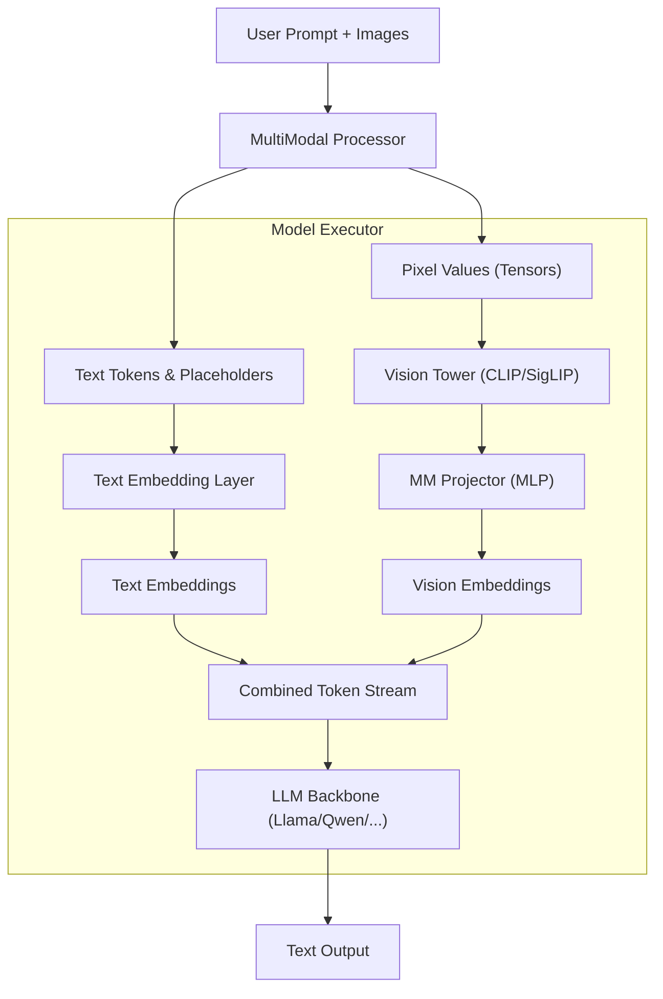

# Chapter 10: Multi-Modal Orchestration & Vision-Language Models

Vision-Language Models (VLMs) extend the reasoning capabilities of LLMs into the visual domain. In vLLM, multi-modal support is not just an "add-on" but a first-class citizen integrated into the serving pipeline, handling the complex orchestration of vision towers, projectors, and token streams.

## Multi-Modal Architecture Overview

A VLM typically consists of three components:
1.  **Vision Tower:** A pre-trained encoder (e.g., CLIP, SigLIP) that extracts features from raw pixels.
2.  **Multi-Modal Projector:** An adapter (usually an MLP or a Resampler) that maps vision features into the embedding space of the Language Model.
3.  **Language Model (LLM):** The causal backbone that processes the concatenated text and vision embeddings.



## 1. Multi-Modal Tower Orchestration

vLLM supports various vision encoders, primarily **CLIP** (Contrastive Language-Image Pre-training) and **SigLIP** (Sigmoid Loss for Language-Image Pre-training).

### Selective Layer Loading
One key optimization in vLLM is initializing the vision tower only up to the "feature layer" required by the specific VLM. For example, if a LLaVA model uses features from the 23rd layer of a 24-layer CLIP encoder, vLLM will skip loading and computing the 24th layer.

```python
# vllm/model_executor/models/llava.py
def _get_num_hidden_layers(hf_config: LlavaLikeConfig) -> int:
    feature_layers = hf_config.vision_feature_layer
    num_hidden_layers = hf_config.vision_config.num_hidden_layers
    # Initialize only up to the deepest required layer
    return max(get_layer_index(idx, num_hidden_layers) for idx in feature_layers)
```

### Vision Feature Selection
Different models use different strategies to select which tokens to pass to the LLM:
*   `class`: Selects only the CLS token (e.g., for classification-heavy tasks).
*   `default`: Selects all patch tokens, excluding the CLS token.
*   `full`: Selects all tokens, including CLS.

## 2. Image Feature Insertion into Token Streams

Unlike text tokens, which map 1:1 to embedding vectors via a lookup table, image features are dynamically generated. vLLM uses a **Placeholder Strategy** to align these two disparate input types.

### The Placeholder Strategy
1.  **Tokenization:** The user's prompt (e.g., `"<image>\nWhat is this?"`) is tokenized. The `<image>` token is treated as a special placeholder.
2.  **Expansion:** The `MultiModalProcessor` expands this single placeholder into $N$ placeholder tokens, where $N$ is the number of tokens the vision tower will produce (e.g., 576 tokens for a 24x24 patch grid).
3.  **Position IDs:** vLLM ensures that `positions` and `attn_metadata` account for these expanded placeholders, so the LLM perceives a continuous sequence of tokens.
4.  **Embedding Replacement:** During the forward pass, the `embed_multimodal` method computes the actual vision embeddings. The engine then swaps the embeddings of the placeholder tokens with these computed features before they enter the first LLM layer.

## 3. Handling Ragged Batches and Multi-Modal Inputs

Multi-modal inputs are inherently "ragged." One request might have three images, while another has none. Images themselves may have different resolutions, leading to different numbers of patch tokens.

### MultiModalFieldConfig
vLLM manages this via `MultiModalFieldConfig`, which defines how multi-modal data is batched:
*   **Batched:** Data is stacked along the batch dimension.
*   **Flat:** Data is concatenated into a single long tensor, with offsets tracking individual items. This is crucial for models like **Pixtral** or **Qwen2-VL** that support variable-sized images.
*   **Shared:** Data is shared across all items in a batch.

### Dynamic Resolution & mRoPE
Modern VLMs like **Qwen2-VL** use **mRoPE (Multimodal Rotary Positional Embeddings)**. Instead of 1D positions, they use 3D positions $(T, H, W)$ to represent temporal and spatial dimensions. 

vLLM handles this by sharding the vision computation across GPUs (Data Parallelism for the vision tower) even when the LLM is Tensor Parallel. This is implemented in `run_dp_sharded_mrope_vision_model`, which load-balances image patches across GPUs based on their total area rather than just the number of images.

## 4. The Data Flow (Feynman Perspective)

Think of the VLM as a translator in a courtroom. 
*   The **Vision Tower** is like a witness who only speaks "Picture-ese." 
*   The **Projector** is the translator who turns "Picture-ese" into "Word-embeddings-ese." 
*   The **LLM** is the judge who only understands "Word-embeddings-ese."

To make sure the judge knows exactly where the witness's testimony fits into the story, we leave a series of empty chairs (Placeholders) in the courtroom. When the witness is ready to speak, their translated testimony is placed into those specific chairs. Even if the witness brings 500 pages of evidence (tokens) or 1000, we simply adjust the number of chairs reserved.

## Implementation Reference
*   **Input Processing:** `vllm/multimodal/inputs.py` (Defines `PlaceholderRange` and `MultiModalKwargsItem`).
*   **Model Integration:** `vllm/model_executor/models/llava.py` (Example of a complete VLM implementation).
*   **Vision Utilities:** `vllm/model_executor/models/vision.py` (Handling feature selection and DP sharding).

---

**Repository Context:** [vllm-project/vllm @ `f69ede49`](https://github.com/vllm-project/vllm/tree/f69ede495b3fe97a4b8f6c74d29627f735d46f33)
