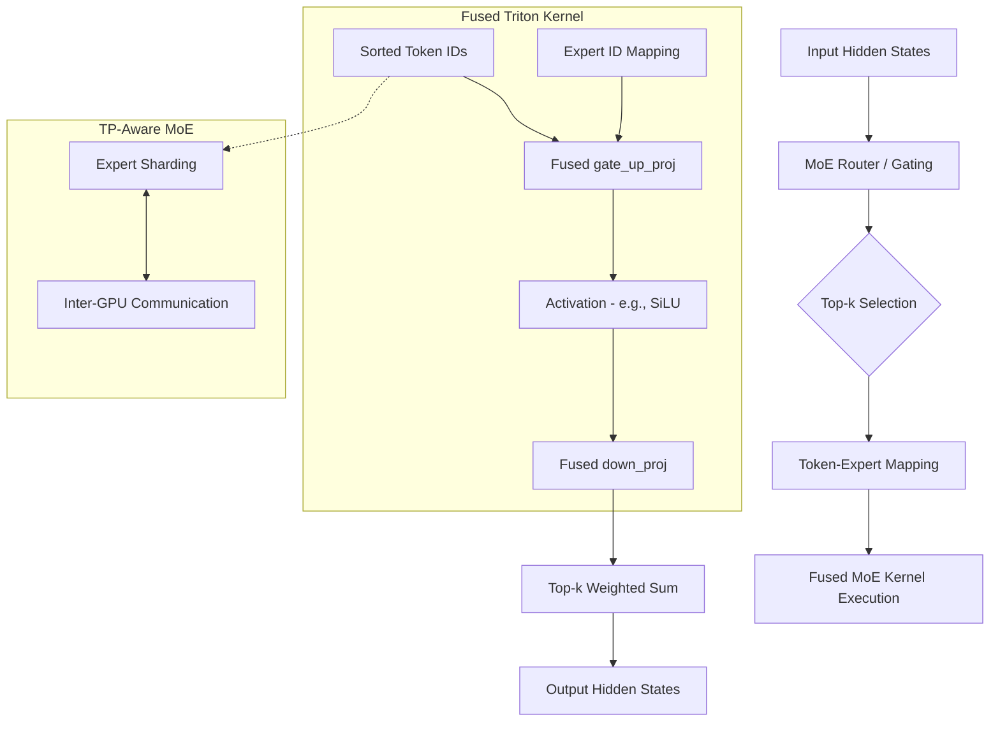

# Chapter 11: Mixture of Experts (MoE) Internals

Mixture of Experts (MoE) is a pivotal architecture for scaling Large Language Models (LLMs) to trillions of parameters while maintaining manageable computational costs during inference. This chapter dives into vLLM's high-performance implementation of MoE, focusing on fused Triton kernels, expert sharding, and kernel tuning.



## 1. MoE Architecture in vLLM

In a standard Transformer layer, every token passes through the same Feed-Forward Network (FFN). In an MoE layer, the FFN is replaced by a set of $E$ independent "experts." A router (gating network) selects the top-$k$ experts for each token.

vLLM's MoE implementation is designed for extreme efficiency, particularly in multi-user serving scenarios where batches are large and diverse.

### Key Components:
- **Router**: Computes logits for each expert and selects the top-$k$ indices.
- **Top-k Gating**: Normalizes the selected expert weights (often via Softmax).
- **Fused Experts**: Instead of launching $k$ separate kernels per token, vLLM uses a single fused kernel to process all routed tokens across all experts.

## 2. Fused MoE Kernels

The core of vLLM's MoE performance is its **Fused Triton Kernels**, located in [`vllm/model_executor/layers/fused_moe/`](https://github.com/vllm-project/vllm/blob/f69ede495b3fe97a4b8f6c74d29627f735d46f33/vllm/model_executor/layers/fused_moe/).

### Why Fusion?
Launching separate kernels for each expert (especially with many experts and small $k$) leads to massive overhead due to:
1.  **Kernel Launch Latency**: Hundreds of tiny kernels saturating the command queue.
2.  **Memory Fragmentation**: Poor memory coalescing when tokens are scattered across experts.

### Implementation Details:
vLLM fuses the `gate_up_proj` (w1 and w3) and `down_proj` (w2) operations.
- **w1/w3 Fusion**: The gate and up-projection weights are often concatenated. The kernel performs a single GEMM and applies the activation (e.g., SiLU) in-place.
- **Token Sorting**: Before the kernel runs, tokens are sorted by their assigned expert IDs. This ensures that the CUDA threads processing a specific expert access contiguous memory.

## 3. Expert Sharding and Parallelism (TP-Aware MoE)

When running on multiple GPUs, MoE experts are typically sharded using **Tensor Parallelism (TP)** or **Expert Parallelism (EP)**.

### Tensor Model Parallelism
In vLLM, if TP is enabled, the expert weights themselves are sharded across GPUs.
- **gate_up_proj**: Sharded along the output dimension (ColumnParallel).
- **down_proj**: Sharded along the input dimension (RowParallel).
- **All-Reduce**: A single All-Reduce is performed after the `down_proj` to combine results from all GPUs.

### Expert Parallelism (EP)
In EP, different GPUs hold different experts. vLLM supports sophisticated placement strategies (EPLB - Expert Parallelism Load Balancer) to ensure that no single GPU becomes a bottleneck if certain experts are "hotter" than others.

## 4. Kernel Tuning (E, N, M Configs)

The performance of the Fused MoE kernel is highly sensitive to the shape of the problem. vLLM uses an automated tuning mechanism to select the best Triton configuration.

### Tuning Parameters:
- **E (Experts)**: The total number of experts in the layer.
- **N (Intermediate Size)**: The hidden dimension of each expert.
- **M (Tokens)**: The number of tokens in the current batch. Since M changes every iteration, vLLM must be dynamic.

### Configuration Files:
Look at [`vllm/model_executor/layers/fused_moe/configs/`](https://github.com/vllm-project/vllm/blob/f69ede495b3fe97a4b8f6c74d29627f735d46f33/vllm/model_executor/layers/fused_moe/configs/). These JSON files contain pre-tuned configurations for specific hardware (e.g., A100, H100) and data types (FP16, BF16, FP8, INT8).

Example config structure:
```json
{
  "BLOCK_SIZE_M": 64,
  "BLOCK_SIZE_N": 128,
  "BLOCK_SIZE_K": 32,
  "GROUP_SIZE_M": 8,
  "num_warps": 4,
  "num_stages": 3
}
```

### Dynamic Selection:
The `try_get_optimal_moe_config` function in [`fused_moe.py`](https://github.com/vllm-project/vllm/blob/f69ede495b3fe97a4b8f6c74d29627f735d46f33/vllm/model_executor/layers/fused_moe/fused_moe.py) maps the current $(M, N, E)$ triplet to the closest optimized configuration. If no exact match is found, it uses heuristics to interpolate:
- **Small M**: Favors smaller `BLOCK_SIZE_M` to maximize occupancy.
- **Large M**: Favors larger tiles to maximize compute throughput.

## 5. Advanced Optimizations

### FP8 and Quantization
vLLM's MoE kernels support FP8 (W8A8) and INT8 quantization. This significantly reduces memory bandwidth requirements, which is often the bottleneck for MoE inference.

### DeepSeek-V3/V4 and Large-Scale MoE
For models with hundreds of experts (like DeepSeek), vLLM implements additional optimizations:
- **Multi-token routing**: Reducing router overhead.
- **Expert Map Manager**: Efficiently tracking which tokens belong to which GPU in highly sharded environments.

## Summary
vLLM's MoE implementation transforms what could be a memory-bound, latency-heavy operation into a compute-efficient, hardware-optimized pipeline. By combining kernel fusion, intelligent token sorting, and dynamic configuration tuning, vLLM remains the gold standard for MoE inference at scale.

---

**Repository Context:** [vllm-project/vllm @ `f69ede49`](https://github.com/vllm-project/vllm/tree/f69ede495b3fe97a4b8f6c74d29627f735d46f33)
