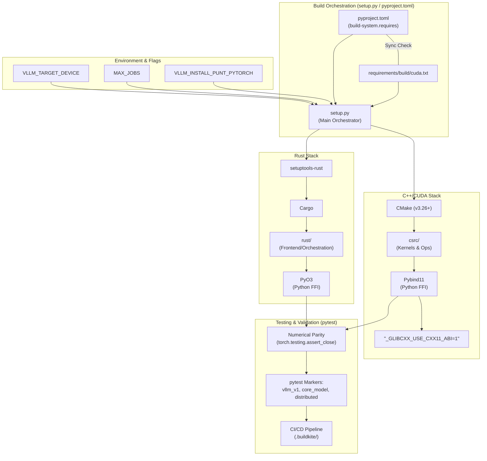

# Chapter 12: Contributing to vLLM – Systems Engineering Edition



Contributing to a high-performance system like vLLM requires a deep understanding of its multi-language architecture, build systems, and rigorous testing matrix. This chapter covers the essential technical requirements for contributors.

## Dependency Mirroring and Syncing

vLLM manages dependencies across multiple files to support various hardware backends and build environments. A critical requirement for contributors is maintaining **Numerical and Dependency Parity**.

-   **`pyproject.toml` vs `requirements/`**: The `build-system.requires` section in `pyproject.toml` must be kept in sync with `requirements/build/cuda.txt` (and other backend-specific build requirements).
-   **Runtime Dependencies**: Core dependencies like `torch` are pinned strictly (e.g., `torch == 2.11.0`) to ensure ABI stability. When updating a dependency, you must ensure it is updated across all relevant `requirements/*.txt` files and `pyproject.toml`.
-   **Why Mirroring?**: `pyproject.toml` is the standard for modern Python packaging, while `requirements/*.txt` files provide granular control for CI/CD, Docker image builds, and local development environments. Discrepancies between these can lead to "works on my machine" bugs or CI failures.

## Numerical Parity Testing

When implementing new kernels in C++/CUDA or optimizing existing Python logic, you must verify that the output remains numerically consistent with the reference implementation.

-   **`torch.testing.assert_close`**: This is the preferred tool for parity testing. It provides robust comparison for floating-point tensors, allowing for controllable absolute (`atol`) and relative (`rtol`) tolerances.
-   **Best Practice**: Every new feature or kernel should include a parity test that compares the vLLM implementation against a trusted reference (e.g., a vanilla PyTorch implementation or a known-good baseline).
    ```python
    import torch
    from torch.testing import assert_close

    # Example: Verifying custom kernel output
    ref_out = reference_implementation(input_tensor)
    vllm_out = vllm_custom_kernel(input_tensor)
    
    assert_close(vllm_out, ref_out, atol=1e-5, rtol=1e-3)
    ```

## ABI Compatibility and FFI Linking

vLLM interfaces heavily with PyTorch's C++ core. This requires strict adherence to ABI (Application Binary Interface) standards.

-   **`_GLIBCXX_USE_CXX11_ABI`**: PyTorch is typically built with the "new" C++11 ABI (`_GLIBCXX_USE_CXX11_ABI=1`). vLLM's extensions must match this setting to avoid linker errors like "undefined reference" when passing `std::string` or `std::vector` across the boundary.
-   **FFI Boundaries**:
    1.  **Python ↔ C++ (Pybind11)**: Uses `pybind11` to expose CUDA kernels. Ensure tensor ownership is clear and the GIL is managed appropriately.
    2.  **Python ↔ Rust (PyO3)**: The Rust frontend uses `PyO3`. Rust components must be built such that they are compatible with the Python interpreter and any C++ libraries they link against.

## Rust Frontend and Cross-Compilation

vLLM's high-performance orchestration layer increasingly utilizes Rust. Managing this in a Python-centric ecosystem involves specialized tools.

-   **`setuptools-rust`**: This is used to build Rust extensions as part of the standard `pip install` process. It handles the invocation of `cargo` and ensures the resulting shared objects are correctly packaged.
-   **Cross-Compilation**: For distributing vLLM across different architectures (e.g., x86_64, aarch64), we rely on `setuptools-rust`'s ability to cross-compile. Contributors working on Rust modules should be aware of:
    -   Target-specific dependencies in `Cargo.toml`.
    -   The need for appropriate cross-compilers (e.g., `musl-tools`) in the build environment.
    -   Using `build_rust.sh` to wrap complex toolchain configurations.

## The Build System and Environment

Key environment variables control the build process:

-   **`VLLM_INSTALL_PUNT_PYTORCH`**: Prevents the installer from overwriting your existing PyTorch installation.
-   **`MAX_JOBS`**: Limits parallel compilation jobs to prevent OOM errors during build.
-   **`VLLM_TARGET_DEVICE`**: Sets the target accelerator (e.g., `cuda`, `rocm`, `tpu`).

The build system utilizes **CMake (v3.26+)** for C++ and **Cargo** for Rust. Use `ccache` or `sccache` to speed up repeated builds.

## The Testing Matrix

vLLM's CI/CD pipeline (via `.buildkite/`) is exhaustive. Use `pytest` with specific markers:

-   **`vllm_v1`**: Tests for the V1 engine architecture.
-   **`core_model`**: Validation for core model architectures.
-   **`distributed`**: Tests requiring multi-GPU orchestration (often using Ray).

---

### Key Source References
-   `pyproject.toml`: Modern packaging and build-system definition.
-   `requirements/build/cuda.txt`: Build-time dependencies for CUDA.
-   `setup.py`: The primary build orchestrator.
-   `csrc/`: C++/CUDA kernel implementations.
-   `rust/`: Rust frontend and orchestration layer.
-   `tests/`: The comprehensive test suite.

---

**Repository Context:** [vllm-project/vllm @ `f69ede49`](https://github.com/vllm-project/vllm/tree/f69ede495b3fe97a4b8f6c74d29627f735d46f33)
